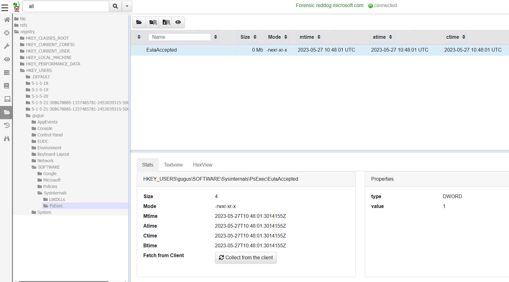

# Velociraptor 03: Introduction (Basic Use)

## Introduction

In this challenge, the goal is to familiarize yourself with Velociraptor. For this purpose, there are several tasks introducing you to the various parts of Velociraptor.

## Author
* Knöpfel, Daniel
* Duijts, Michael

## Task

Now that you have the Velociraptor deployment running, let's collect some Artifacts. As you may know, Sysinternals tools create a registry key when they're first run. On Forensic.winattacklab.local and using Velociraptor, find out which Sysinternals tools have been run by users on the system.

## Manual

> Manually look through the registry

* Client auswählen
* Virtual Filesystem
* registry


* In Registry Current User sieht man unter Volatile Environment den Usernamen
* In Registry unter User sind nicht angemeldete User nicht ersichtlich
* Im Filesystem unter Users alle User ersichtlich
* Registry von anderen User mounten
  * Host Information
  * Shell (oben rechts)
  * `reg load HKU\gugus C:\Users\annanass\NTUSER.DAT`
  * Danach ist die Registry unter `HKU\gugus` wie oben beschrieben auslesbar



## Notebook

> Design your own VQL query and use the Notebook

```
SELECT * FROM foreach(
    row={
        SELECT FullPath FROM glob(globs="C:/Users/**/ntuser.dat")
    },
    query={
        SELECT * FROM glob(globs=url(scheme='ntfs', path=FullPath, fragment='SOFTWARE/Sysinternals/**/*'), accessor='raw_reg')
    }
)
```


## Hunt

> Run a hunt on only Forensic to get the information

```
name: Custom.Artifact.Sysinternals
description: |
   Searching for clients where Sysinternals tools ran

# Can be CLIENT, CLIENT_EVENT, SERVER, SERVER_EVENT
type: CLIENT

parameters:
   - name: DummyParameter
     default: Just for Demo and not used

sources:
  - precondition:
      SELECT OS From info() where OS = 'windows'

    query: |
        SELECT * FROM foreach(
            row={
                SELECT FullPath FROM glob(globs="C:/Users/**/ntuser.dat")
            },
            query={
                SELECT * FROM glob(globs=url(scheme='ntfs', path=FullPath, fragment='SOFTWARE/Sysinternals/**/*'), accessor='raw_reg') WHERE Name != "EulaAccepted"
            }
        )
```


* Select Hunt and click play
* Select Hunt and click Clients
* FlowId (to see results)
* Results > Resultate des Query ersichtlich