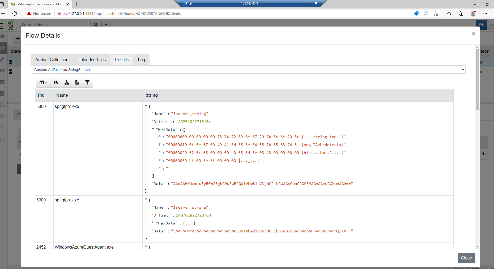

# Velociraptor 0: Yara

## Introduction

In this challenge, the goal is to familiarize yourself with Velociraptor. For this purpose, there are several tasks introducing you to the various parts of Velociraptor.

## Author
* Knöpfel, Daniel
* Duijts, Michael

## Task

> You know that a malicious binary is running on Forensic. All that is known about the process is that it contains the string `IAmUndetectable`. From that, the following YARA rule can be created:

```
rule DetectMalware {
    strings: $search_string = "IAmUndetectable"
    condition: $search_string
}
```

## Notebook

Basic VQL Query
```
SELECT * FROM foreach(
    row={
        SELECT * FROM pslist() WHERE Name != "velociraptor-v0.6.4-2-windows-amd64.exe" and Name != "msedge.exe"
    }, query={
        SELECT Pid, Name, String FROM yara(
            accessor="process",
            files=format(format="/%d", args=Pid),
          //  context=20,
            rules='rule DetectMalware { strings: $search_string = "IAmUndetectable" condition: $search_string }')
    }
)
```

## Hunt

```
name: Custom.Artifact.YaraStringSearch
description: |
   Search memory for a specified string

# Can be CLIENT, CLIENT_EVENT, SERVER, SERVER_EVENT
type: CLIENT

parameters:
   - name: SearchString
     default: IAmUndetectable

sources:
  - precondition:
      SELECT OS From info() where OS = 'windows' OR OS = 'linux' OR OS = 'darwin'

    query: 
        SELECT * FROM foreach(
            row={
                SELECT * FROM pslist() WHERE Name != "velociraptor-v0.6.4-2-windows-amd64.exe"
            }, query={
                SELECT Pid, Name, String FROM yara(
                    accessor="process",
                    files=format(format="/%d", args=Pid),
                    context=20,
                    rules=format(format='rule DetectMalware { strings: $search_string = "%v" condition: $search_string }', args=SearchString))
            }
        )
```




## Varia

Links: 
- https://docs.velociraptor.app/blog/2021/2021-04-16-digging-into-process-memory-33c60a640cdb/