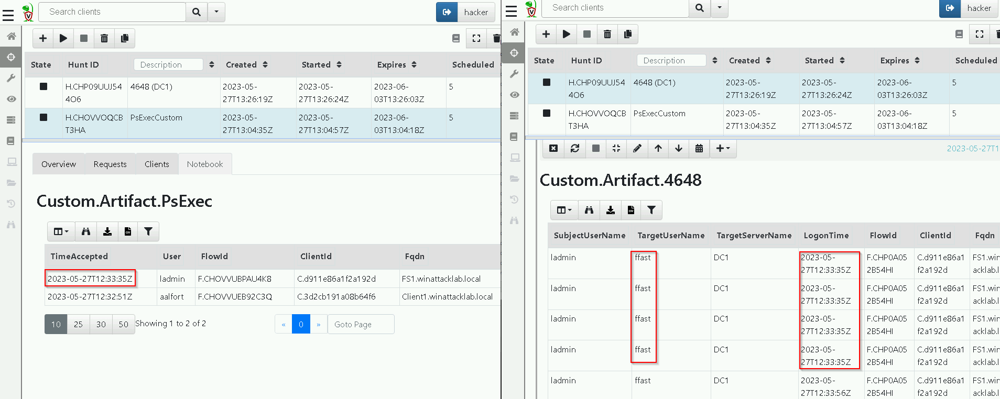

# Velociraptor 05: Lateral Movement

## Introduction

Lateral movement means to move within the internal network to access the organization’s target data and to exfiltrate the data. In this challenge you will solve tasks to detect lateral movement using Velociraptor.

## Author
* Knöpfel, Daniel
* Duijts, Michael

## Goal

From the previous task you know that someone exfiltrated the files from Domain Controller DC1 using the compromised Domain Administrator account ffast. In this task, we want to find out how the adversary compromised the Domain Administrator account ffast. You suspect that the attacker used the pass the hash technique with Psexec and mimikatz. Now it is your task to prove that.

## Task

> Provide an Artifact that detects the execution of PsExec. The Artifact must show the first execution time of PsExec in date time format.

```
name: Custom.Artifact.PsExec
description: |
   Filtered for PsExec

# Can be CLIENT, CLIENT_EVENT, SERVER, SERVER_EVENT
type: CLIENT

sources:
  - precondition:
      SELECT OS From info() where OS = 'windows' OR OS = 'linux' OR OS = 'darwin'

    query: |
      SELECT TimeAccepted, Fqdn, User FROM Artifact.Windows.Registry.Sysinternals.Eulacheck() WHERE ProgramName = "PsExec"
```


> Use Windows Event ID 4648 to find out the user that executed PsExec to become Domain Administrator ffast on destination computer (i.e. DC1). Provide an Artifact for this purpose. It should show at least the parameters SubjectUserName, TargetUserName, TargetServerName and LogonTime (in date time format) from Windows Event ID 4648.

```
name: Custom.Artifact.4648
description: |
   Filtered for EventID 4648 and TargetServerName DC1

# Can be CLIENT, CLIENT_EVENT, SERVER, SERVER_EVENT
type: CLIENT

sources:
  - precondition:
      SELECT OS From info() where OS = 'windows' OR OS = 'linux' OR OS = 'darwin'

    query: |
      SELECT SubjectUserName, TargetUserName, TargetServerName, timestamp(epoch=LogonTime) as LogonTime FROM Artifact.Windows.EventLogs.AlternateLogon() WHERE TargetServerName =~ "DC1"
```

> In question 1 and 2 you found some timestamps in date time format. Do a temporal correlation with them. And reason if they could relate to each other.



SubjectUserName und Zeit stimmen überrein, weshalb man annehmen kann, dass die beiden Informationen korreliert werden können.

> Use Windows Event ID 4624 to find the user that executed PsExec to become Domain Administrator ffast on the source computer.

```
name: Custom.Artifact.4624
description: |
   This is the human readable description of the artifact.

# Can be CLIENT, CLIENT_EVENT, SERVER, SERVER_EVENT
type: CLIENT

parameters:
  - name: securityLogFile
    default: C:/Windows/System32/Winevt/Logs/Security.evtx

sources:
  - precondition:
      SELECT OS From info() where OS = 'windows' OR OS = 'linux' OR OS = 'darwin'

    query: |
      SELECT timestamp(epoch=System.TimeCreated.SystemTime) as TimeCreated, EventData.IpAddress as IpAddress, EventData.TargetUserName as TargetUserName, EventData.LogonType as LogonType, EventData.WorkstationName as WorkstationName FROM parse_evtx(filename="C:/Windows/System32/Winevt/Logs/Security.evtx") WHERE System.EventID.Value = 4624 AND EventData AND LogonType != 5 and LogonType !=4 // and WorkstationName =~ "fs1"
```

2023-05-27T12:33:29Z	-	ladmin	2	FS1
2023-05-27T12:33:29Z	-	ladmin	2	FS1

> Find out if mimikatz was executed using Velociraptor and Amcache.

```
name: Custom.Artifact.Amcache
description: |
   This is the human readable description of the artifact.

# Can be CLIENT, CLIENT_EVENT, SERVER, SERVER_EVENT
type: CLIENT

parameters:
   - name: FirstParameter
     default: Default Value of first parameter

sources:
  - precondition:
      SELECT OS From info() where OS = 'windows' OR OS = 'linux' OR OS = 'darwin'

    query: |
        SELECT * FROM Artifact.Windows.System.Amcache() WHERE Name =~ "katz"
```