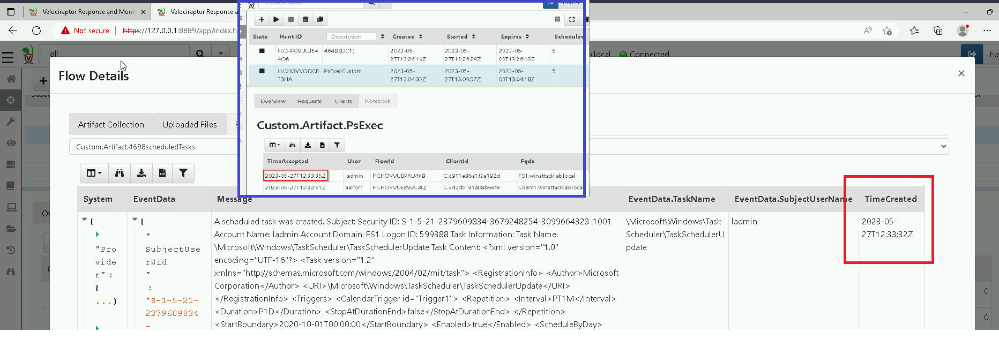
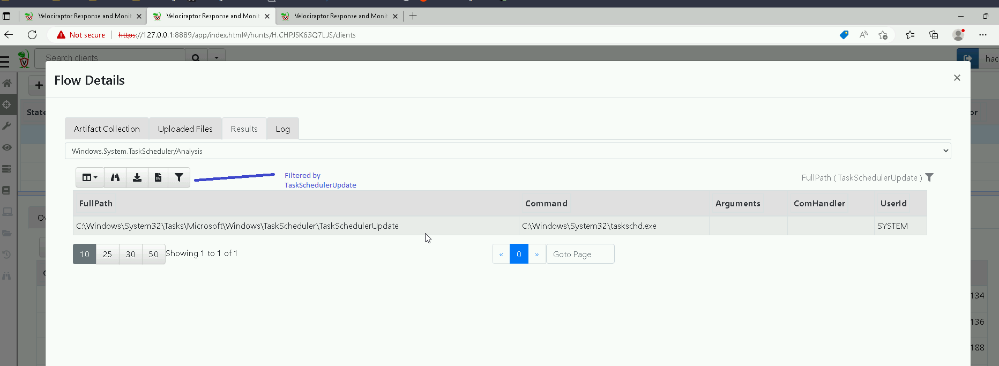
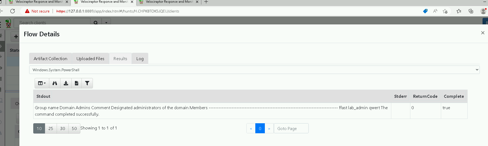

# Velociraptor 06: Persistence

## Author
* Knöpfel, Daniel
* Duijts, Michael

## Goal

In the previous challenge Lateral Movement we found that the adversary used PsExec and Mimikatz to become Domain Administrator. Before doing that the adversary persists himself, because he wants to regain access, when he loses the connection to the target. Now you are going to solve some tasks to check what persistence mechanism the adversary used.

## Task
> Write an Artifact that displays events containing Windows event ID 4698. Include the rows `TaskName` and `LogonTime`

```
name: Custom.Artifact.4698scheduledTasks
description: |
   This is the human readable description of the artifact.

# Can be CLIENT, CLIENT_EVENT, SERVER, SERVER_EVENT
type: CLIENT

parameters:
  - name: securityLogFile
    default: C:/Windows/System32/Winevt/Logs/Security.evtx

sources:
  - precondition:
      SELECT OS From info() where OS = 'windows' OR OS = 'linux' OR OS = 'darwin'

    query: |
      SELECT EventData.TaskName, EventData.SubjectUserName, timestamp(epoch=System.TimeCreated.SystemTime) as TimeCreated FROM parse_evtx(filename="C:/Windows/System32/Winevt/Logs/Security.evtx") WHERE System.EventID.Value = 4698 AND EventData  // and WorkstationName =~ "fs1"

```


> Do a temporal correlation with the results from task 1 and the result from task 1 in the challenge `Lateral movement`. Can you detect a relation between the two results? Which task could therefore be the malicious one?



It seems that the the malware first takes care of persistance (on FS1) and then tries to move laterally.
Times correlate as it is described in MITRE Detection: https://attack.mitre.org/techniques/T1053/005/


> Find more information about the malicious scheduled task you found in task 2 by using a built in Artifact from Velociraptor. Specifically, find out what is executed when the scheduled task is run.



File that is scheduled/executed: "taskschd.exe". We quickly checked the local filesystem and on the net, there seems to be no such file in normal windows installations in /Windows/System32 (but a "taskschd.dll")


> Besides the one from tasks 1-3, the adversary used another technique for persistence. You might actually have spotted it already in a previous challenge. Find out which one it is.



The following domain admins were found:  ffast lab_admin qwert 

Artifact to search for Created accounts: 
```
name: Custom.Artifact.4720AccountCreated
description: |
   This is the human readable description of the artifact.

# Can be CLIENT, CLIENT_EVENT, SERVER, SERVER_EVENT
type: CLIENT

parameters:
  - name: securityLogFile
    default: C:/Windows/System32/Winevt/Logs/Security.evtx

sources:
  - precondition:
      SELECT OS From info() where OS = 'windows' OR OS = 'linux' OR OS = 'darwin'

    query: |
      SELECT timestamp(epoch=System.TimeCreated.SystemTime) as TimeCreated, EventData.TargetUserName As TargetUserName, EventData.SubjectUserName as SubjectUserName, EventData.SamAccountName As SamAccountName, EventData.DisplayName as DisplayName, EventData.PrimaryGroupId as PrimaryGroupId FROM parse_evtx(filename="C:/Windows/System32/Winevt/Logs/Security.evtx") WHERE System.EventID.Value = 4720 AND EventData 

```
With this artifact we found that account "qwert" was created at 2023-05-27T12:34:02Z on the domain controller "DC1". 

Our interpretation is that the attacker created the domain admin "qwert" as a means of persistance to regain access.  