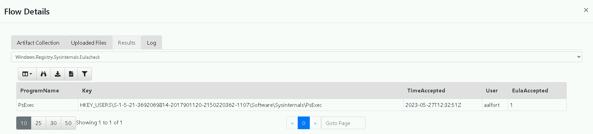

# Velociraptor 07: Privilege Escalation: Domain User to Local Admin

## Author
* Knöpfel, Daniel
* Duijts, Michael

## Goal

Find out how the attacker logged in as ladmin and where from.
As your solution, submit - in text form - the answer to the following questions:
* What tools did the attacker use to log in as ladmin on FS1? List the proof you've found.
* Did he hop machines again? If so, how do you know?
* How did he get the credentials of ladmin?

## Task

> What tools did the attacker use to log in as ladmin on FS1? List the proof you've found.

Successful logins FS1:

| TimeCreated          | IpAddress | TargetUserName | LogonType | WorkstationName |
| -------------------- | --------- | -------------- | --------- | --------------- |
| 2023-05-27T12:33:08Z | 10.0.1.10 | aalfort        | 3         | -               |
| 2023-05-27T12:33:08Z | 10.0.1.10 | aalfort        | 3         | -               |
| 2023-05-27T12:33:08Z | 10.0.1.10 | aalfort        | 3         | -               |
| 2023-05-27T12:33:08Z | 10.0.1.10 | aalfort        | 3         | -               |
| 2023-05-27T12:33:29Z | 10.0.1.10 | aalfort        | 3         | -               |
| 2023-05-27T12:33:29Z | 10.0.1.10 | aalfort        | 3         | -               |
| 2023-05-27T12:33:29Z | 10.0.1.10 | aalfort        | 3         | -               |
| 2023-05-27T12:33:29Z | 10.0.1.10 | aalfort        | 3         | -               |
| 2023-05-27T12:33:29Z | -         | ladmin         | 2         | FS1             |
| 2023-05-27T12:33:29Z | -         | ladmin         | 2         | FS1             |
| 2023-05-27T12:33:35Z | ::1       | ladmin         | 9         | -               |

Aufgrund der Zeit und Reihenfolge wird wohl Aalfort und `10.0.1.10` der vorherige Schritt des Angreifers sein.

Event 4672, Special Privileges
| TimeCreated          | SubjectUserName | SubjectDomainName | SubjectLogonId | PrivilegeList                                                                                                                                                                                                          |
| -------------------- | --------------- | ----------------- | -------------- | ---------------------------------------------------------------------------------------------------------------------------------------------------------------------------------------------------------------------- |
| 2023-05-27T12:33:29Z | ladmin          | FS1               | 599388         | SeSecurityPrivilege SeTakeOwnershipPrivilege SeLoadDriverPrivilege SeBackupPrivilege SeRestorePrivilege SeDebugPrivilege SeSystemEnvironmentPrivilege SeImpersonatePrivilege SeDelegateSessionUserImpersonatePrivilege |
| 2023-05-27T12:33:35Z | ladmin          | FS1               | 666393         | SeSecurityPrivilege SeTakeOwnershipPrivilege SeLoadDriverPrivilege SeBackupPrivilege SeRestorePrivilege SeDebugPrivilege SeSystemEnvironmentPrivilege SeImpersonatePrivilege SeDelegateSessionUserImpersonatePrivilege |
| 2023-05-27T12:33:37Z | ladmin          | FS1               | 668398         | SeSecurityPrivilege SeTakeOwnershipPrivilege SeLoadDriverPrivilege SeBackupPrivilege SeRestorePrivilege SeDebugPrivilege SeSystemEnvironmentPrivilege SeImpersonatePrivilege SeDelegateSessionUserImpersonatePrivilege |

Amcache Abfrage auf FS1. psexesvc.exe ist ersichtlich

PSExec wurde auf Client1 ausgeführt

> Did he hop machines again? If so, how do you know?

> How did he get the credentials of ladmin?

Credentials sind auf dem Domain Controller im Sysvol.
`C:\Windows\SYSVOL\domain\Policies\{50F48C59-3B90-494E-8C93-2ECDA255E2CE}\Machine\Preferences\Groups\Groups.xml'`

