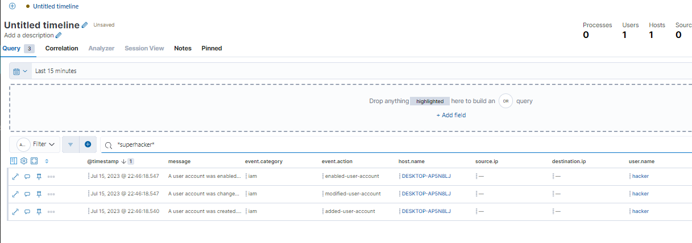

# Create "Hunts" (Detection) using EQL


## Task 1 RDP Brute force

**1. Enable RDP on Windows**
In Admin Powershell execute: 
```
Set-ItemProperty -Path 'HKLM:\System\CurrentControlSet\Control\Terminal Server' -name "fDenyTSConnections" -value 0
Enable-NetFirewallRule -DisplayGroup "Remote Desktop"
```
*Remark: got an error when writing to the registry.  Manually checked: value is "0" so still ok.*


**2. Brute force attack using Linux**

```
cp /usr/share/wordlists/rockyou.txt.gz ~
cd ~
gunzip rockyou.txt.gz
hydra -t 1 -V -f -l someuser -P rockyou.txt rdp://192.168.127.185
```
-> will now try to connect brute force via rdp using passwort list (for user "someuser")


**3. EQL rule**
Detect 10 failed logins in a row (doesn't really detect rdp, just )
```
sequence with maxspan=50m
[authentication where event.action == "logon-failed"] with runs=50
```
alternative (here with just 5 runs)
```
sequence with maxspan=50m
[authentication where event.action == "logon-failed"]
[authentication where event.action == "logon-failed"] 
[authentication where event.action == "logon-failed"] 
[authentication where event.action == "logon-failed"] 
[authentication where event.action == "logon-failed"] 
```
-> we could now create rules that trigger alert (like in previous exercise)


## Task 2 RDP Brute force

**1. create admin user via powershell**

In admin powershell execute:
```
New-LocalUser -Name "superhacker" -Description "test dummy" -NoPassword
Add-LocalGroupMember -Group "Administrators" -Member "superhacker"
```

**2. Search for events in timeline**

First search timeline for related events. 
Limit by relative time and then initially "*" all events and then limit by created user "*superhacker*"




**3. Create EQL for hunt**

```
sequence with maxspan=10m
[iam where event.action == "added-user-account"]
[iam where event.action == "modified-user-account"]
```

-> we could now create rules that trigger alert (like in previous exercise)

