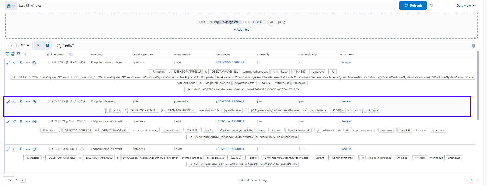

# Improve Detection

Goal: write my own rules/EQL queries to detect threads that were previously undetected. 

*remark: running tests (Atomic Red Team) locally and not remote (as in identifying gaps)


## T1546.008 Test #2: Replace binary of sticky keys

Attack script: 
```
IF NOT EXIST C:\Windows\System32\sethc_backup.exe (copy C:\Windows\System32\sethc.exe C:\Windows\System32\sethc_backup.exe) ELSE ( pushd )
takeown /F C:\Windows\System32\sethc.exe /A
icacls C:\Windows\System32\sethc.exe /grant Administrators:F /t
copy /Y C:\Windows\System32\cmd.exe C:\Windows\System32\sethc.exe
```
see: https://github.com/redcanaryco/atomic-red-team/blob/master/atomics/T1546.008/T1546.008.md#atomic-test-2---replace-binary-of-sticky-keys


Approach
1. new timeline (limited by time)
    - search for "*sethc*"  (KQL) to find events
2. analyze events that were triggered
3. Overwritting sethc.exe file seems to be a reasonable pick to detec event. 
    - check details




## Improved detection
EQL: 
`file where event.action in ("overwrite") and file.path.caselessname:("c:\windows\system32\sethc.exe")`

now we can create a rule and we will get an alert when seth.exe is bing overwritten.
