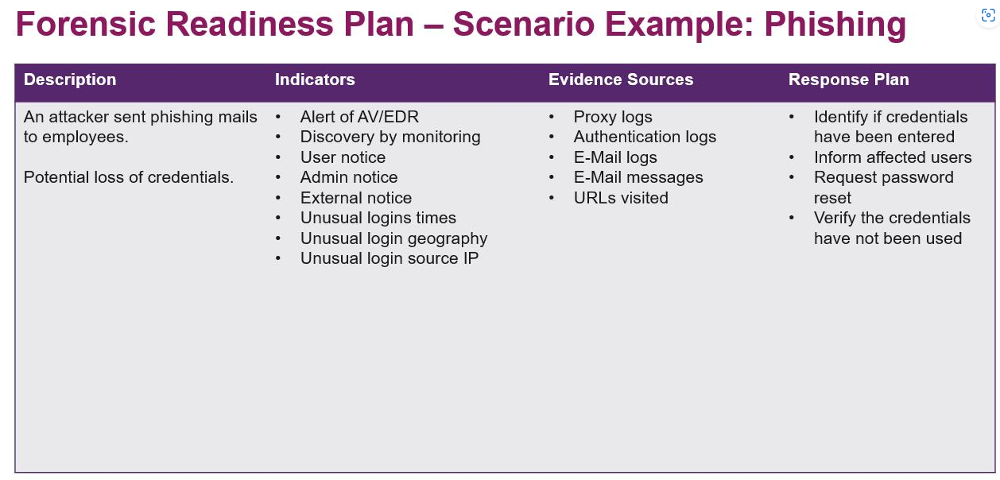

# Develop scenarios

https://github.com/certsocietegenerale/IRM

Example for pishing

## Scenario Denial of Service

**Description**
Availability of some systems is reduced due to a DOS attack. This could lead to: loss of business, loss of trust from customers, legal problesm (not fulfilling contracts, missing backups etc.)
It is unlikely - but not impossible - that some attacking servers are withing the same network when some machines are compromised.

**Indicators**
- Alert of EDR 
    - for example a prolonged high CPU usage on a system could trigger an alert
    - high network traffic (lots of the same source/destination IP's)
    - combination of the above
- Services stop working (for example: websites)
- Connection
- external or internal complaints about performance and/or availablility

**Evidence Sources**
- Resource monitoring (CPU power, Memory)
- Proxy logs
- EDR logs 
- Application logs 
    - for example uncompromised applications connecting to services under attack run into timeouts
    - logs of attacked services might indicate an attack by logging too many requests at the same endpoint etc. (depends on attack and application)
- Windows logs
    - some applications log to windows log

**Response Plan**
- Determine which systems are affected (under attack) and where the attack comes from (IP)
    - checking logs (mainly network related logs: router, firewalls, proxy) to get source IP (and destination IP)
- Block attack on the network level via router/firewall/proxy
    - try to block attackers IP as early as possiblej..
        - if not possible: webserver might be able to block source and not handle request (often a feature of webserver)
    - in some cases throttlign would be possible as well
    - in some cases disabling the feature temporarily is an option (it should be predetermined which services can be temporarily shut down, otherwise business will have to be contacted)
    - in the unlikely case, internal machines are also participating in the attack, these servers are to be considered compromised and treated as such (separate scenario)
-  Inform internet service provider (ISP) and ask for help and instructions
    - maybe the can block the attack at an earlier level etc.
- inform stackeholders (usually in this order)
    - internal security team
    - company wide (if affected)
    - customers (if affected)
    - potentially others (press, etc.)
- Try to find out why we could be under attack (might not be possible)
- Recovery
    - are servers reachable again?
    - restart services
    - check loss (loss of business deals for example)
        - is it worth investigate more
    - check legal consequences
        - can/should/will we sue someone for the loss (very unlikely)
        - have we breached a contract (e.g. availability?)
    - inform stakeholders
- Lessons learned
    - better (earlier) detection possible?
    - response plan ok as it is?
    - changes to infrastructure needed?
    - changes to applications (unlikely)
        - some application can reduce their vulnerability to DOS attacks. (Example: PDF exports take a lot CPU power. A measure would be that an application is only ever running 1 export at a time)
    - are some IP's still to be blocked (e.g. IP's unlikely to be of any relevance.. easier with a company just operating locally)
        - when do we have to revise the list of blocked IP's?

## Scenario Website XSS attack

**Description**
When a website has XSS vulnerabilities, the attacker can control the html layout and the request that are triggered from this website. He can: 
- lure the user into doing something he/she doesn't want (mainly by controlling layout/texts of website)
    - entering credentials
    - execute an action non intended
    - etc. 
- trigger request with the user credentials (if user is logged in)
- redirect the user to some other webpage

An XSS attack can lead to money and reputation loss (e.g. transactions executed in an e-banking application) 

**Indicators**
- Alerts from EDR system 
    - which monitor for suspicious request (also nof of reqeusts within a timeframe might be a factor, especially when coming from the same source)
    - also potentially relevant: time and source IP
- Notice/complaints
    - likely comming from affected users (customers?)
- Discovery by monitoring 
    - network traffic, WAF logs, webserver logs etc.

**Evidence Sources**
- Proxy/Network/webserver logs
- Data (database)
    - in the case of stored XSS
- email messages/logs   (only when combined with a pishing attack)
    - in the case of reflected or DOM based XSS, a pishing attack is not unlekely as the user has to click on a constructed url
    - scenario for pishing might apply here too

**Response Plan**
- Determine and verify which site(s) is affected
- Determine potential business impact of vulnerability
    - potentially shut down website till fixed (depends on expected down time and importance)
    - potentially let it keep running
- inform stackholders
    - internal team
    - company wide (if service is down)
    - affected users
- Fix vulnerability on application level if possible
    - Depending on deployment process and application (intern/external) this might not be possible
    - otherwise inform (internal) developer team or vendor to fix it in next release (low prio)
- Fix vulnerability via infrastructure tools (e.g. regex blocking these type of request)
    - WAF configuration
    - webserver configuration
- Recovery
    - ensure website is online again (if no longer vulnerable)
    - maybe undo ifrastructure configuration if fixed on application level (and maybe not)
    - check loss (loss of business deals for example)
        - is it worth investigate more
    - check legal consequences
        - can/should/will we sue someone for the loss (very unlikely)
        - have we breached a contract (e.g. availability?)
    - inform stakeholders
- Lessons learned
    - check if response plan ok
    - check if we need infrastructure measures (WAF)
    - check if process to buy websites hosted internally need to be reviewed with security in mind
        - audit etc.
    - check if development process needs to be reviewed
        - safe programming
        - security check on used libraries
        - audit process

*remark: some of this is applicable to other attacks on websites (CSRF, SQL injection)*

## Scenario Aliens infiltrate our IT with vastly superiour technology

| Description | Indicators | Evidence Sources |  Response Plan | 
| ----------- | ----------- | ----------- |  ----------- |  
| Aliens take full control over our IT | 1. not possible to log in. 2. It administrator all of a sudden has a huge green head with big eyes  | no event/log or any other indicator | submit to the aliens and hope for the best |