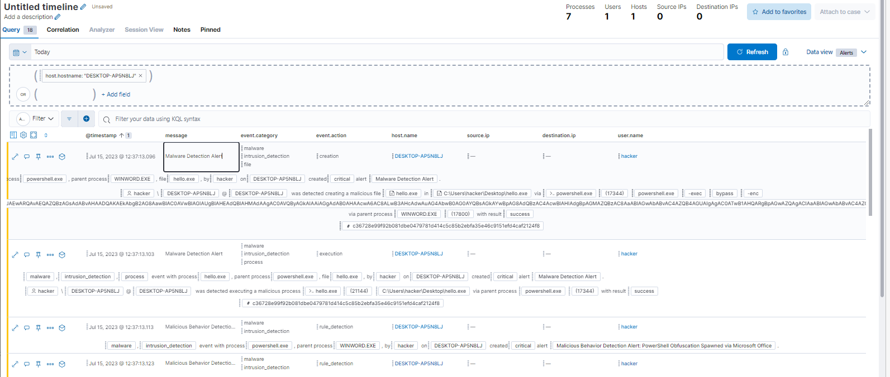

# Microsoft Office Dropper & Ransomware (Analysis and Detection)

## Steps

**1a. Setup Choco and Office Runtime** (via powershell as admin)
```
Set-ExecutionPolicy Bypass -Scope Process -Force; [System.Net.ServicePointManager]::SecurityProtocol = [System.Net.ServicePointManager]::SecurityProtocol -bor 3072; iex ((New-Object System.Net.WebClient).DownloadString('https://community.chocolatey.org/install.ps1'))
choco install microsoft-office-deployment -y

```
Remark: already done in Setup Environment lab 14  (Office already installed)

**1b Sample & Testdata** (powershell as local user!!!)

```
cd $env:USERPROFILE/Desktop
mkdir test
cd test
Invoke-WebRequest -Uri https://www.notmalicious.services/zip_10MB.zip -OutFile "zip_10MB.zip"
7z x .\zip_10MB.zip
cd $env:USERPROFILE/Desktop
Invoke-WebRequest -Uri "https://www.notmalicious.services/invoice-Amazon.docm" -OutFile "amaz0n-inv0ice.docm"
Unblock-File amaz0n-inv0ice.docm

```
*Remark: to get amaz0n-inv0ice.docm Windows security Settings have to be disabled (maybe more than just real time protection) (done in "Setup Env Lab")*
*Remark2: Check windows security -> windows automatically turns the settings back on from time to time (restart?)*

**2. Run malware**
Just click on Word "amaz0n-inv0ice.docm" downloaded before, word starts and we click on "Enable Content" to let macro run. 

Possible problems
- Windows security Settings have to be disabled (maybe more than just real time protection) (done in "Setup Env Lab")
    - Windows somtimes turns security settings back on. So if it doesn't work check again
- Elastic prevent execution (there should be some kind of popup)
    - Turn prevention actions of via "Security > Manage > Policy" kann ich Protections disabled.  (set to detect but not prevent)
- hello.exe appears but nothing else (no ransomnote): maybe a Powershell 7 problem ???
    - I had to install PowerShell-7.3.5-win-x64.msi 
        - installed via msi downloaded from official microsof website (and enabled path etc. in installer)
        - probably made a mistake during setup
*Remark: "hello.exe" can be executed separatly (that is basically what macro does)*

Timestamp: "15.7.2023 12:32:46"

**3 Timeline**



Findings:
- Malware was detected. Multiple critical events were triggered
- Easy to follow which processes were started by whom: Office > Powershell > Hello.exe > cmd.exe > wbadmin.exe 
    - Hello.exe seems to be responsible to for encrypting
    - cmd.exe/wbadmin.exe should probably prevent restore from backup to some degree (not verified)
- Separate events for creation and executions
- Powershell obfuscation created a separate event (Rule "Malicious behavrio detection Alert: PowerShell ...")


*Remark: filtering by host seemed enough for me (at least with my set of date). Could have filtered by timestamp '@timestamp <= "2023-07-1T13:10:10' (UTC)" or event."action.exists" etc.*

**4 Sandboxes**
- VirusTotal
    - https://www.virustotal.com/gui/file/c36728e99f92b081dbe0479781d414c5c85b2ebfa35e46c9151efd4caf2124f8
    - detected as RansomWare
- Cuckoo sandbox
    - https://mlwr.ee/analysis/4129021/summary/
    - suspiciuos: score 10/10 (even Yara rule detected)


**5 Ransomware Behavior (Mitre)**

Used behaviors according to Mitre https://attack.mitre.org/

| ATTACK | Name | Event | Notes |
| ----------- | ----------- | ----------- |  ----------- |
| T1204.002 | User execution: Malicious File | Execution from Macro enabled Office doc | User clicks on word file |
| T11059.001 | Command and Scripting Interpreter: PowerShell | PS execution detected   |  |
| T1059.003 | C&S: Windows Command Shell | Cmd execution detected | started from hello.exe | 
| T1486 | Impact: Data Encrypted for Impact | | basically the core of ransomware | 
| T1490 | Inhibit System Recovery | execution of vssadmin.exe and bcdedit.exe |  | 


Remarks: 
- initial access not as this has already happened when file is present

**6. IOC Indicator of compromise**

| Type | IOC | Description | 
| ----------- | ----------- | ----------- |  
| Hash| User execution: Malicious File | Hash of exe (Hello.exe) |
| File endings| Creation of files ending with .ost | |
| File content| Presence of file encryption indicator| Encrypted files usually have a marker (not verified here) |
| Filename | Presence of file "ransomenote.txt" on desktop|  |
| Filename | Presence of file "ransom.jpg" on desktop|  |
| Process tree| Office macro starting Powershell (or cmd etc.) | |

**7. Hunt IOC in timeline**
See lab task

Limit just by host (as done before)
- Explore > Hosts > click on Hostname in table > Investigate by timeline
    - we see all the events there (filtered by hostename and event.kind: "signal"). We can add additional filters on fields via KQL

Search for process
- Starting from timeline (where we were before): > correlate 
    - Enter EQL: `process where process.hash.sha256:("c36728e99f92b081dbe0479781d414c5c85b2ebfa35e46c9151efd4caf2124f8")`


**8. Create hunt for ransom software behavior**
See lab task: 
```
sequence with maxspan=10m
  [ file where event.type in ("change","deletion","creation")  and file.extension:("jpg","docx","zip")]
  [ file where stringContains(file.name, "ost") ]
  [process where process.hash.sha256:("c36728e99f92b081dbe0479781d414c5c85b2ebfa35e46c9151efd4caf2124f8") ]
```
EQL query extended with hash. (probably not ideal as too specific)

```
sequence with maxspan=10m
  [ process where process.parent.name:("WINWORD.EXE","powershell.exe")]
  [ file where event.type in ("change","deletion","creation")  and file.extension:("jpg","docx","zip")]
  [ file where stringContains(file.name, "ost") ]
```
EQL used for rule later on. Detects that powershell is started from Word and then we see some rename actions and filenames end with ost. 


**9. Create a rule out of it (and test)**
Creating see via Security > Manage > Rules > Create new rule (more see lab task)


After enabling custom rule, repeat attack (open word file) to see if rule works. 


## Solutions
see steps