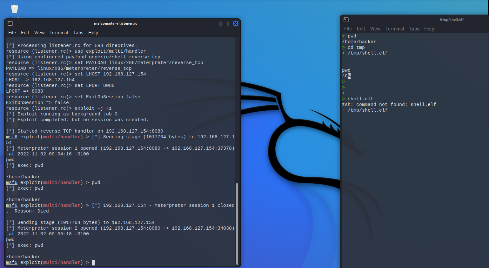

# Metasploit Reverse shell answers

### Security questions
1. Explain how the reverse shell works:
    - Who opens the TCP connection and to which IP / Port?
        - Answer: the victim shell will open the connection on port 8080
    - Who opens the shell? Who has control over it? Which computer runs the commands entered?
        - Answer(s):
            - the vicitms pc opens the shell, which is then controlled by attacker but the commands are actually executed on the victims pc.
    
2. Add a screenshot of the reverse shell, similar to the one in step 6 (make sure to show the active sessions and run at least one command on it)

### Screenshot

### Varia
eth0 IPV4: 192.168.127.154 in my hackinglab
Problems generating the shell.elf (at some point it worked.. dont know what caused the problems before) 