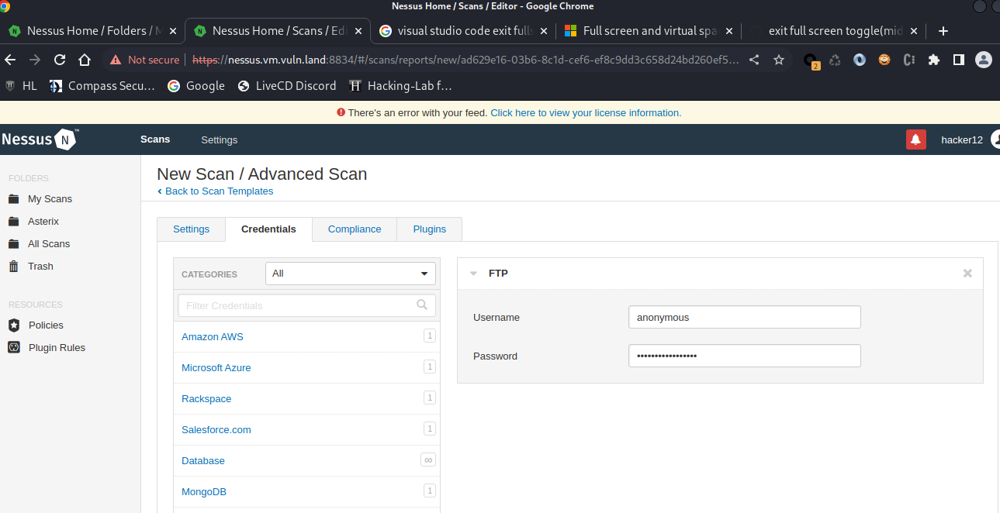
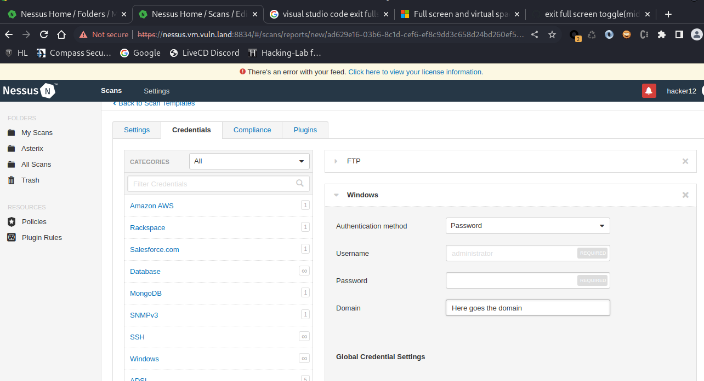
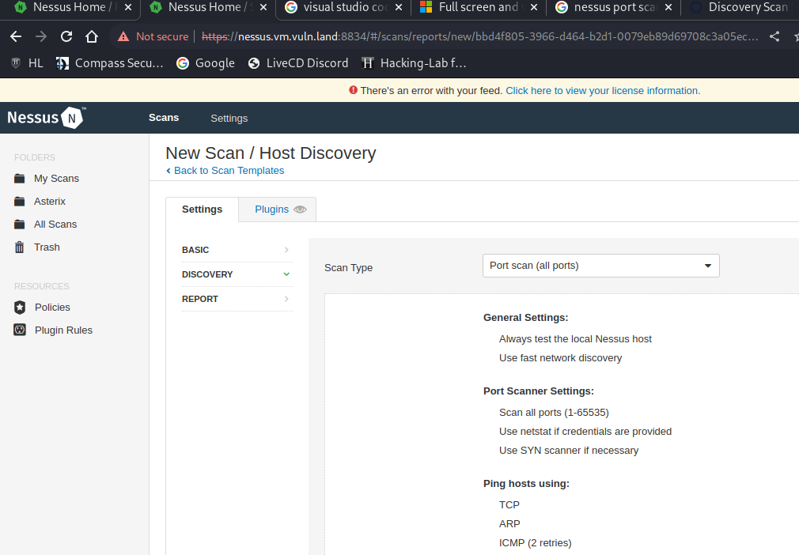

# Nessus Answers

1. Configure credentials Ftp service: 

2. Configure domain in Nessus

3. Configure portscan (prio to vulnerability scann)
Portscan can be easily configured (screenshot) and all the open ports can be accessed via "Nessus SYN scanner" (INFO)

4. Possible to run brute-force attach agains ssh service?
    -  yes via plugin (https://www.tenable.com/plugins/nessus/15888 )   
    - no plugins available therefore no screenshot
        - There is a checkbox "Only use credentials provided by the user" that can be unchecked (but I don't see how this would make a it a brute force attack on SSH)
