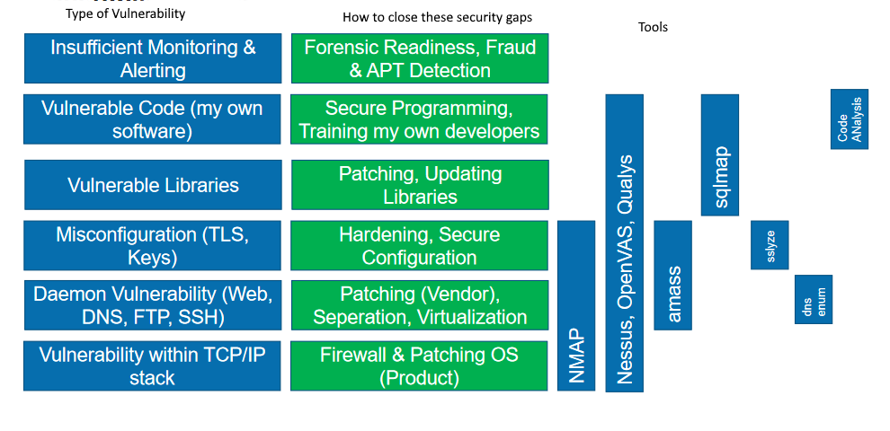

# Vulnerability scanning

Tools to automate vulnerability detection at large scales (usually backed by databases and "attach scripts")
https://youtu.be/sfT_qEw3Fcs

Good for: 
- outdated software
- misconfiguration (e.g. weak SSL)
- known issues
Not ideal for: 
- complex, logical issues
- highly customized services and applications
Problems: 
- likely to contain false positives
- not all vulnerabilities can be detected
- scanner may crash target system
- scanner is noisy 

### Host OS Vulnerability scanning
Usually run on the host itself. 

1. Services
2. Patch level
3. File Permissions
4. Process Permissions
5. Configurations

**Host security scanner**
- Microsoft Baseline Security Analyzer (Windows)
- Linux security tools (see power point)

### Network vulnerability scanning
Different ways (simple: just try scanning via firewall). One way is to have agents that actually to the scans which then report. 

Not 100% sure what to make of these diagram s

According to diagram: 
1. TCP/IP Stack
2. Application Server (e.g. Apache, NodeJs etc.)
3. Libraries & Shared Objects
4. My App
5.   <Firewall>
6. TCP/IP Stack

or
1. Inventory
2. Connectivity (Firewall) (Port Scanning)
3. Vulnerability Scanning (CVE)
4. Application Vulnerability Scanning (HTTPS, Mail, API, ...)
5. Verification (Exploitation)

 
 
**Network Security scanner**
- Nessus  (commercial and free edition)
- ...

### Varia

**Default passwords**
Default accounts: "Shodan Internet of Things" (not fully clear what this is)
project with default pw: https://github.com/scadastrangelove/SCADAPASS

**Web Application Security Scanner**
- Qualis (commercial, is also a network scanner)
- Aunetix Web Application Scanner 
- ...

