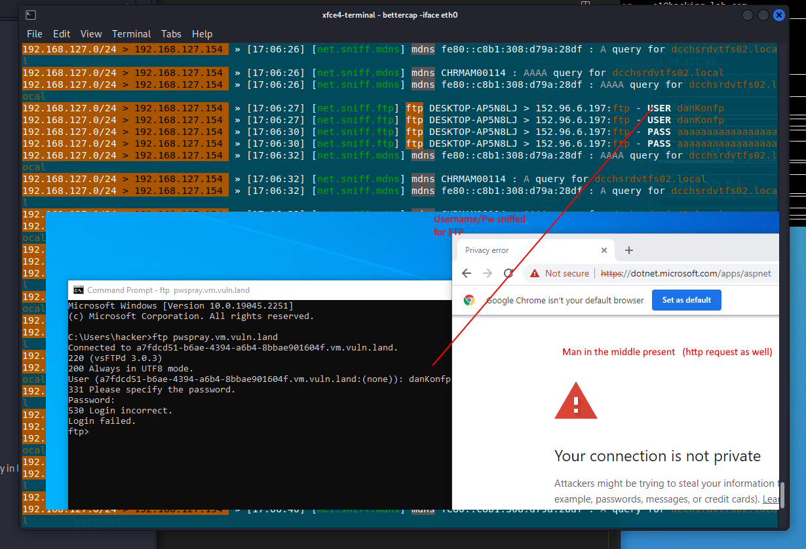

# Bettercap

### Answers

1. explain why bettercap was able to capture the ftp credentials
    - Answer: from my understanding bettercup acts as "man in the middle" via arp.spoofing. Traffic of known machines within the same network is first sent to the machine bettercup - the "man in the middle" - runs on before it is forwared to the actual destination.  (provided "arp.spoof is on") Since FTP is a simple protocol without any encryption etc. credentials can be sniffed ("net.sniff on")
2. do a research for bettercap and find out what caplets are
    - Answer: In a terminal, bettercap is accessed via a interactive session. (Meanin: once you start bettercap  (e.g. `dbettercap -iface <networkinterface>`) the user's input is treated as input for bettercap). Like in a normal bash, the user can enter commands and thus execute bettercap commands. It is possible to save a series of commands in file, or to put it differently, "to script a session using caplets". Caplets are script files (.cap extension) that script bettercap commands to automate bettercap workflows. A saved caplet file can then be executed as follows: `sudo bettercap -caplet someCapletFile.cp`. It is also possible to reference javascript files to implement more advanced features.
3. read these examples: https://www.cyberpunk.rs/bettercap-usage-examples-overview-custom-setup-caplets
    - Examples for some specific use cases like transparent http proxy,  dns spoofing etc.
4. please add a screenshot of your MitM attack (proof your setup)

**Leftovers**

Https 
- to log http requests, use the http-req-dump cablet as described
Web-UI
- `bettercap -caplet /usr/share/bettercap/caplets/https-ui` as root 
- in browser https://127.0.0.1 > will get to login screen
- seems to be a black screen (just "Time" "Type" bar) without any possibility to interact
    - not tried any further as it was discussed that this doesnt seem to work (lots of js errors in browser console)

**Thoughts on bettercap**

Bettercap seems to be THE tool for man in the middle attack. To me it seems that it is especially powerful within the same network (due to arp spoofing) but it seems to have other features. I believe I have only touched the surface as it supports a) more features but also a rest api, which might be my prefered way automate and orchestrate checks (and attacks)

### Bettercap
Commands when you are not (!) in a bettercap session
- `bettercap -iface eth0` ->  starts bettercap for eth0 interface
- `bettercap -eval "net.probe.on; ticker on"` ->  starts net.probe and ticker, "separated by ";" (if interface is not passed, it will use default interface)
- `bettercap -eval "help"` -> will run help command (all services down except events.stream as as bettercap is not running in this terminal )
- `bettercap -iface eth0 -caplet /usr/share/bettercap/caplets/http-req-dump/http-req-dump.cap -eval "set arp.spoof.targets 192.168.242.131"` ->  another example

Some commands if you are in a bettercap session: 
- `net.show` -> network info (IP, MAC)
- `help` -> shows all the modules (and whether they are running or not)
- `help http.proxy` -> detailed help for a module
- `http.proxy on` -> turning on module http.proxy
- `active` -> shows info about all the running modules
- `quit` -> leave session
- `!<bash command>` -> Prefix a normal bash command with "!" (Example: "!pwd")

https://www.bettercap.org/
https://www.cyberpunk.rs/install-mitm-attack-framework-bettercap (and follow up articles)
https://www.cyberpunk.rs/bettercap-usage-examples-overview-custom-setup-caplets

### Varia/notes

**My setup (basic info)**

IP of linux machine (HackingLab): 192.168.127.154
IP of windows machine: 192.168.127.157

**ssl splitting**

Technique to ensure integrity of data served from proxies. SSL splitting proxy merges authenticatino records from server with data records from a cache (proxy must have acces to server encryption keys )
https://pdos.csail.mit.edu/papers/ssl-splitting-usenixsecurity03/ 
