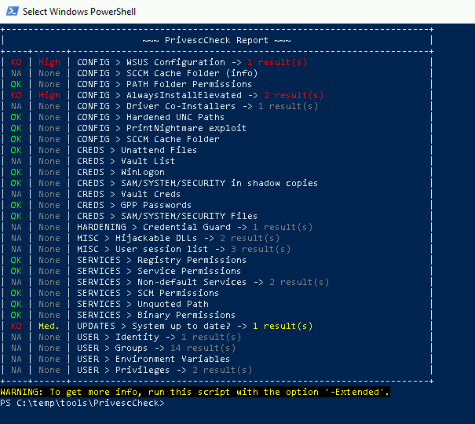
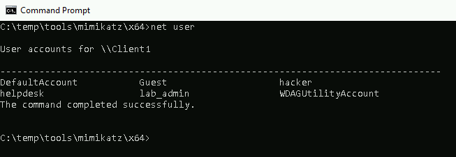
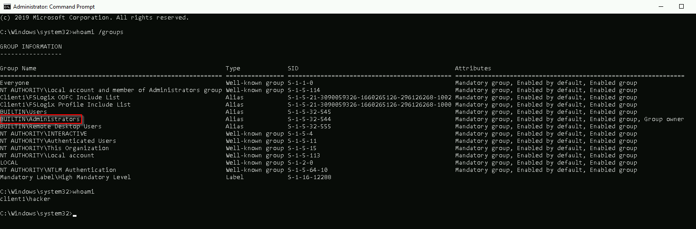

# Windows Attack Lab - Step 3 - Situational Awareness & Privilege Escalation on Windows 10 Client

After having established the initial connection to your Windows 10 client via RDP, we will first assess the situation on the machine. This should give you an idea about the available attack surface and possible options to escalate your privileges.

Your current user tmassie is a regular user on the machine and does not have local admin privileges.

## Author
* Knöpfel, Daniel
* Duijts, Michael 

## Methodology

PrivescCheck  
```powershell
Import-Module .\PrivescCheck.ps1
Invoke-PrivescCheck
```


Neuer User:


Gruppen vom neuen User:


## Answers

* Explain the vulnerability you used for privilege escalation.
  * The registry setting "AlwaysInstallElevated" is set to 1 (for machine and user). This means that any msi installer runs as admin without the UAC dialog prompting the user to confirm or enter username/password (which is what would happen on the used windows machine)
* Can you use the new user account to log on to another machine and why?
  * No, the created user is a local account
* Explain if the cmd.exe was started in an elevated context and how you can tell that from the output of whoami /groups?
  * we see that the hacker belongs to the Administrators group (BUILTIN\Administrators). 
* If yes, explain how you “bypassed” UAC?
  * As explained before, we managed to create an admin user via Msi and the "AlwaysInstallElevated" vulnerability. We can now use our admin user for any UAC prompt.
* How can you prevent such an attack?
  * Ensure "AlwaysInstallElevated" is NOT set to 1 (true).