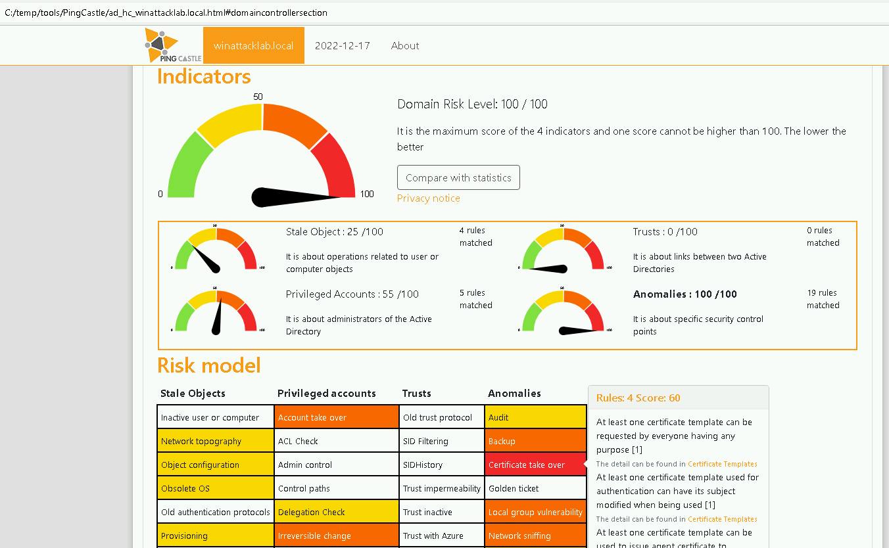
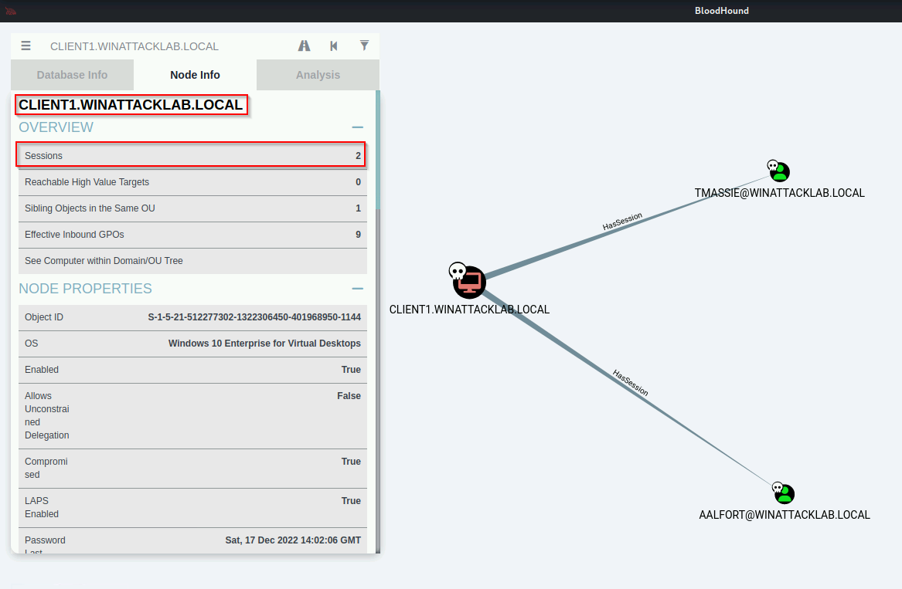
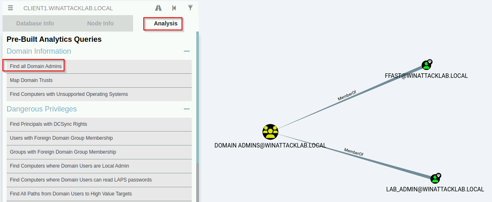

# Windows Attack Lab - Step 4 - AD Information Gathering & Analysis

## Author
* Knöpfel, Daniel
* Duijts, Michael 

## Methodology

PingCastle Results:

Bloodhound Client1 Sessions:

Bloodhound Alle Domain Admins:

## Answer

* Based on what you learned from Bloodhound, what is your next target?
  * AALFORT@WINATTACKLAB.LOCAL
  * Mit diesem User kann man sich auf dem FS1.WINATTACKLAB.LOCAL als Admin anmelden
* What is required to get the credentials for the next target?
  * Admin User um einen dump vom lsass Prozess
* How exactly can we dump the credentials for the next target?
  * Mimikatz verwenden um einen Dump vom lsass Prozess zu erstellen
  * Alternative sind der Task Manager und Process Explorer, wo ebenfalls ein Dump für den lsass Prozess erstellt werden kann
* Why do you think the query "Shortest Paths to Domain Admins from Owned Principals" does not show any results?
  * Zum Zeitpunkt des SharpHound Scans waren nicht genügend Sessions vorhanden, um einen Weg zum Domain Admin zu finden