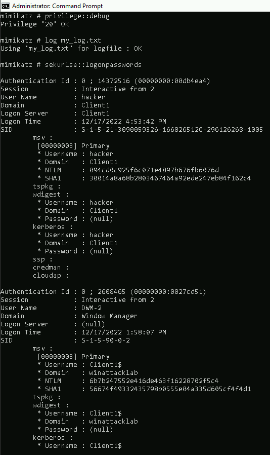
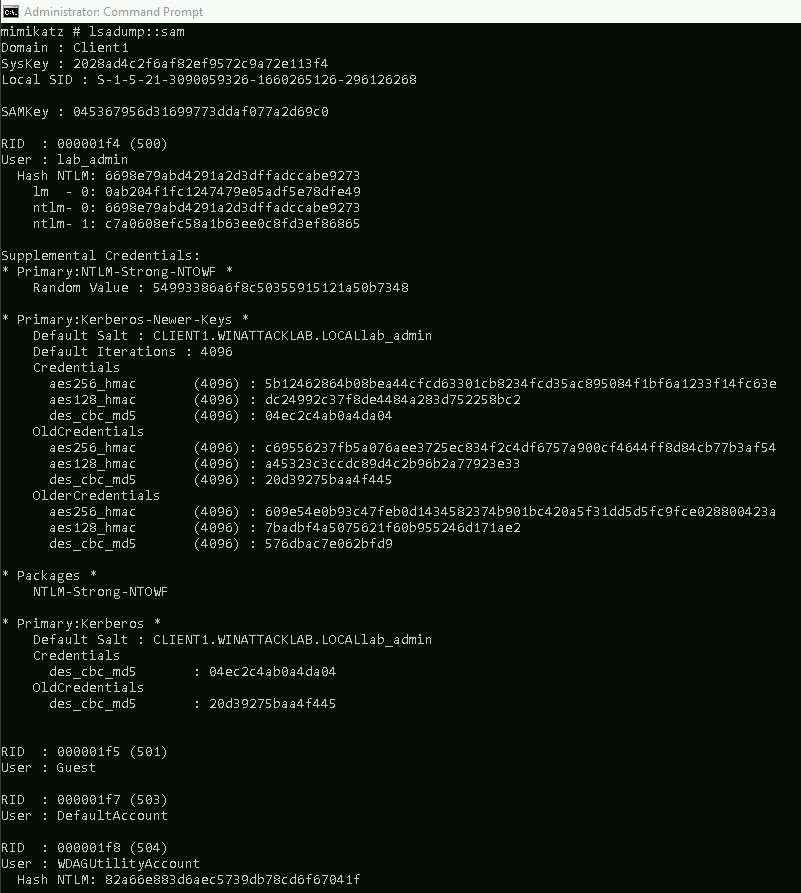

# Windows Attack Lab - Step 5 - Credential Dumping on Windows 10 Client

If you have local administrative privileges on a Windows machine, you can abuse this to retrieve various forms of credentials stored on the respective machine. This includes credentials of local user accounts (stored in the SAM file) as well as temporarily cached credentials of currently logged-in users (kept in the memory of the lsass process).

## Author
* Knöpfel, Daniel
* Duijts, Michael 

## Methodology
LSASS Dump:

SAM Dump:

## Answer

* Why does Mimikatz need debug privileges?
  * to access the memory of a running process 
* What are the prerequisites that your current session has SeDebugPrivileges?
  * Being in the Administrator group (Usually, only admins have this privilege)
* What are you going to do next with the NTLM hash of user Aalfort?
  * We will log in to FS1.WINATTACKLAB.LOCAL and create a local admin to ensure we always have access, even if aalfort changes his pw or is deleted.
* Why can user Aalfort’s credentials be found in the LSASS memory of Client1
  * User credentials of currently logged in users are stored in the memory of the LSASS process.
