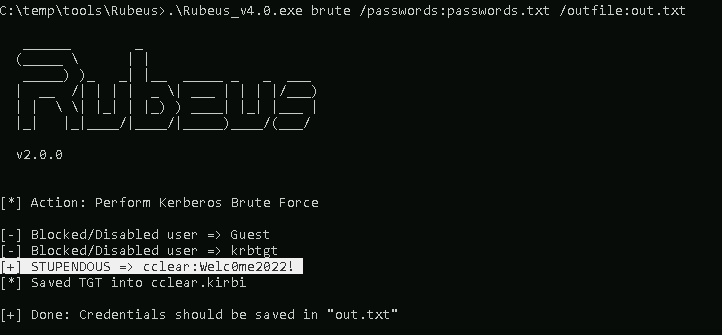
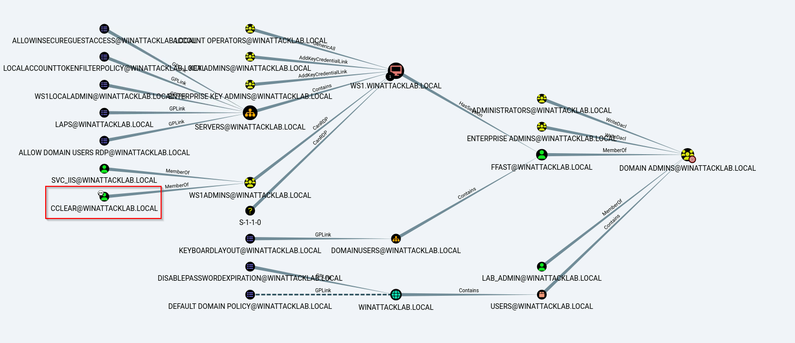

# Windows Attack Lab - Step 8 - Password Spraying

## Author
* Knöpfel, Daniel
* Duijts, Michael

## Methodology

Checking lockout policy, in this case no policy lockout policy is defined.
```
C:\temp\tools\SharpHound>net accounts /domain
The request will be processed at a domain controller for domain winattacklab.local.

Force user logoff how long after time expires?:       Never
Minimum password age (days):                          0
Maximum password age (days):                          Unlimited
Minimum password length:                              7
Length of password history maintained:                24
Lockout threshold:                                    Never
Lockout duration (minutes):                           30
Lockout observation window (minutes):                 30
Computer role:                                        PRIMARY
The command completed successfully.
```

Then we can use the initial passwords for password spraying to check if some users didn't change their initial password.  
`.\Rubeus_v4.0.exe brute /passwords:passwords.txt /outfile:out.txt`


Mit der Ansicht "Find Shortest Paths to Domain Admins" sah man schnell, das der gefundene cclear verwendet werden kann um Domain Admin zu werden.
With the "Find Shortest Paths to Domain Admins" view, one quickly saw that the cclear could be used to become a domain admin.


## Answers

* What is the difference between Password Spraying and Brute Force attacks?
  * Password Spraying: Use only a few or one password and only change the usernames. Usernames could be guessed but in this case we have all usernames from Active Directory.
  * Brute Force: Test many different passwords for one (or very few) known usernames
* Why do we care about the lockout policy?
  * We don't want to be locked out for a longer timeframe
  * Also (many) locked accounts could alarm the Security
* If we stay below the lockout threshold, are we sure that the attack cannot be detected?
  * No
  * It's less likely to get detected because many locked accounts are very noisy/striking
  * But good EDR/XDR Tools can detect many login tries. Usually it's still one target client and if there many login atempts from one attacker this can be alarmed
* We “guessed” the credentials of user Cclear – nice, but what is the underlaying security problem here?
  * Using a predictable pattern for initial passwords
  * Using weak initial passwords, a Brute Force attack would probably find this password still very fast
* Finally the query "Shortest Paths to Domain Admins from Owned Principals" provides a result – why?
  * Because we now own cclear
  * cclear has access to a server where a domain admin session is active
* What is the next step to become domain admin?
  * Login to WS1 and use Mimikatz to get all NTLM hashes from lsass process
  * Because ffast (who is Domain Admin) has an active session, we then should own a NTLM hash of a Domain Admin