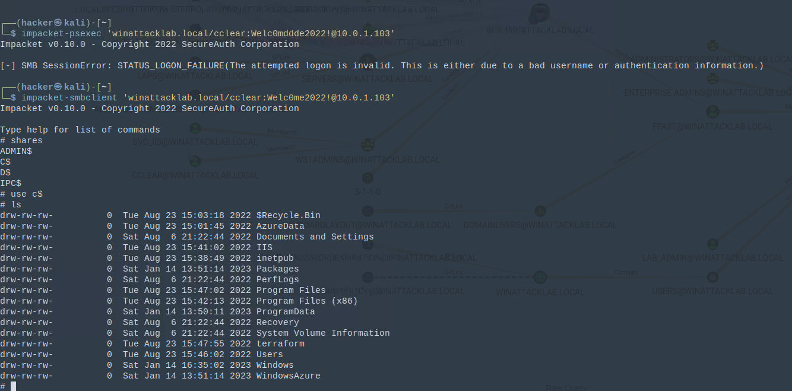

# Windows Attack Lab - Step 9 - Lateral Movement to WS1

## Author
* Knöpfel, Daniel
* Duijts, Michael

## Methodology

First verificate the new credentials from cclear.  
`impacket-psexec 'winattacklab.local/cclear:Welc0me2022!@10.0.1.103'`  
This looks good but no successful connection could be established. To verify if credentials are the reason the connection couldn't establish we can execute `impacket-psexec` with a wrong password.
```
impacket-psexec 'winattacklab.local/cclear:Welc0mddde2022!@10.0.1.103'
[-] SMB SessionError: STATUS_LOGON_FAILURE(The attempted logon is invalid. This is either due to a bad username or authentication information.)
```
Now we get a clear hint for a wrong password, found credentials for cclear has therefore to be valid.

Because `impacket-psexec` can be detected and blocked by Windows Defender (and other tools) we now use `impacket-smbclient`.



## Answers

* Why is the lateral movement technique with psexec easily detected?
  * Windows defender can detect connections initiated by psexec and blocks them. Publicly known tools - like tool in the Impacket collection - are easily detectable.
* Does a psexec alert always indicate bad behavior?
  * No. Psexec is a tool that can be used to administrate infrastructure, like starting/stopping service.
* Why is smb access via smbclient not detected?
  * Smb is a standard protocol and no service is created on the target system.
* What is the next step to become domain admin?
  * Since we are local admin on WS1.WINATTACKLAB.LOCAL we can get the NTML hash of currently logged on users (using Mimikatz or some other tool). From bloodhound we know, that this is doable.

## Question
- Why didn't we just log to to WS1.WINATTACKLAB.LOCAL via RDP as we have the password?