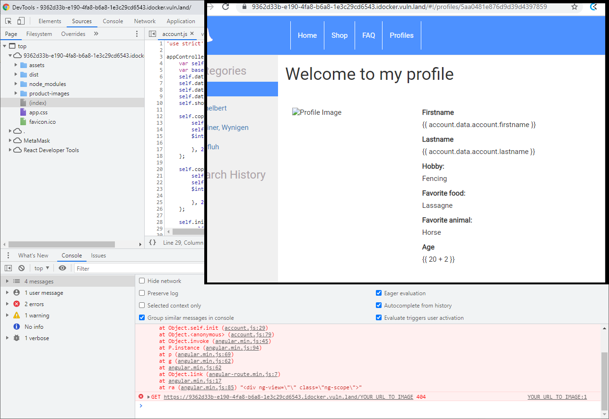

# Template injection (Glockenemmil)

### My attempts

Was not successful at CSTI. To me it seemed that the template was not executed at all.  (see screenshot that is using the default template. 
Otherwise I would have tried to use an approach described in this website.

https://book.hacktricks.xyz/pentesting-web/client-side-template-injection-csti

### Security Questions

**Explain the security problem**
The template can be edited by the user (aka uploaded) and is then interpreted/executed on the "Welcome to my profile" page. 
As the user data becomes part of the template, it is possible to inject malicious code into the template.
(Inserting script is not possible, it seems the tempalte engine (or some other mechanism) takes care of that)

**Explain your attack (exploit, screenshot, hacking journal)**
I tried to inject js code such as `{{ constructor.constructor(&#x27;alert(&#x22;this works even with HTML encoding&#x22;)&#x27;)() }}` 
taken from:  https://book.hacktricks.xyz/pentesting-web/client-side-template-injection-csti but was not successful. (My test template is in the upload)

I then found out that the problem was, that the template didn't work at all in chrome. (it works in Firefox, I noticed that only after I looked at the steps)

So basically the idea to let your own code run by the template engine. 

**Explain mitigation (remedy)**
1.  It is not a good idea to make templates dynamic. (Allowing to upload a template that is exactly that. ). The idea of templates is - I assume - not to be dynamic but to have placeholders to be filled with data. 
2. If for some reason, one still wants to use dynamic templates, it is crucial that the data is filtered (or validated and rejected) so no template expressions can e injected. Example: remove all "{{", "}}" strings for angularJS templates (might not be enough). 

