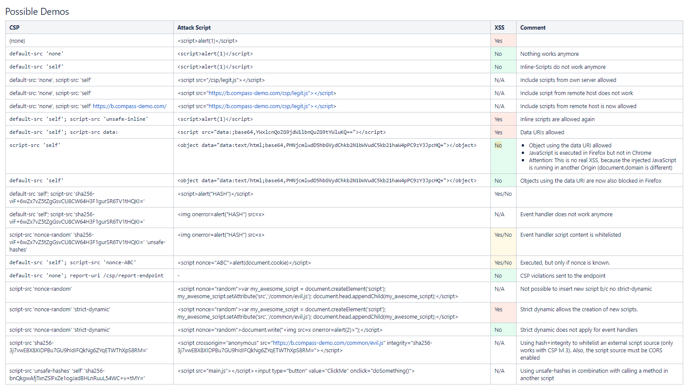

# Web basics


Infos about web security:  https://owasp.org


Most important: 
- secure sysetm design
- secure programming

risk mitigation (as we fail when it comes to system design + programing)
- defense in depth
    - isolation/containers
    - least privilege: policies
    - filrewalls
- testing > fixing 
    - root cause fixint / virtual patching
- attack detection -> response


## Attacks and Defenses

### XSS
- Stored XSS (stored in db)
    - Example: cookie could be stolen (if cookie is accessible)
    - scales well as every user accessing a site
- Reflected XSS
    - Example: `<a>href="www.vulnerable.com?search?<scriptalert(1)</script>>?`
    - often used in prepared links in pishing mails
- DOM-Based XSS  (aka "type-0 XSS")
    - not sent to server: usually No WAF protection !!! 
    - Site code: `var pos = document.URL.indexOf("name=") + 5;document.write(document....)`  (here we read part of the url that is not sent ot the server (input right of #))
        - attack url: `http://www.example.com/welcome.html#name=<script>alert('bla')</script>`
    - frameworks often have this vulnerability
    - finding: 
        - find sources: location.search, location.href
        - test for html sinks
        - automated testing

https://html5sec.org  (and other)


Solution: correct encoding  (usually html encode)
Mitigation: 
    - Sanitaze input
    - http only cookie
    - CSP (Content security policy)
    - WAF  (Web application firewall)
        - will analyze/filter traffic


### XSRF/CSRF: Cross site request forgery 
Example: 
1. user is logged in to eBanking and is authenticated via cookie
    - browser will send cookies implicitly
2. user opens malicious website (maybe hacked website) in another tab in the same browser
    - website sends request to eBanking site and browser will also send authentication cookie: NOT GOOD

Same origin policy doesn't always help because: 
    - mainly applies to javascript triggered requests
        - post is possible via form (that is automatically sent via JS)
            - only for simple forms/requests, otherwise preflight requests is triggerd which would block
        - Get is easily possible: 
    - site might have CORS "*"

Solution:
    - SameSite Cookie Attribute
    - XSRF token 
        - random token that is validet on the server so user has to be on the site first
            - from a security point of view, token can be the same per session (however, often easier to have it per reqeust as we might have other problems otherwise (backbutton etc.))
        - often used for forms (but concept also works for ajax/fetch... but would have to be applied a bit differently)
        WAFS can inject XSRF token (so application doesn't have to do it)
Mitigation
    - Same Site policy (CORS) 
        - implicit protection or non-simple requests
Other: 
    - additionaly header that copies cookie

### SSRF Server side request forgery
Example  
1. Request to webserver: `/index.php?url=https://localhost:8080/admin.php?action=somethingEvil`
2. Webserver will make another request with url that was passed via url

Critical as systems within DMZ are accessible from the webserver.
Very difficult to use block lists for passed url (better use an allow list)

SSRF Defense
- no user supplied urls if possible
- very strict validation of urls


### CSP (Content security policy)**  
Defense: Firewall for the browser -> will probably become more important
Prevents code injection attacks like XSS (supported by modern browsers). Must be tailored to the applicication (not an ON/OFF directive)

Enable via: 
- HTTP Response Header: `Content-Security-Policy: default-src 'self';`  (only allow for onself)
- HTML Tag `<meta http-equiv="Eontent-Security-Policy">`

Allows granular control over resources. CSP Can control almost any resource Type:
- style sheets
- images
- javascript  (most important against XSS)
    - also can be used to block: eval, setInterval("codeAsString)   (setInterval/setTimeout still possible when functions are passed)
- websockets
- etc.
-> there is a monitor mode which doesn't block but just reports violations. 

Example configuration against XSS: 
- don't allow inline-scripts (will prevent XSS coming from data)
- only from known sources (usually 'self')
-> `content-security-policy: default-src 'self'; object-src 'none';`   (will not allow inline scripts, not sure if object-src is needed as we have default)



**Common problem: not possible to get rid of inline scripts**
- Hashes (quite cumbersome to implemnet as hash changes when script changes)
    - hash inline script (only for script tags)
    - 'unsafe-hashes' for methods called in event handlers (<input type="button" onclick="doSomething()">)
- Nonces
    - example: 
        - `Content-Security-Policy: default-src 'self; 'strict-dynamic' script-src 'nonce-'aabbb'`
        - `<script type="text/javascript" nonce="aabbb"`
    - important for nonce to be cryptographically secure (random, bi enough)
    - Flag "strict-dynamic" will pass down nonce to subdependency (which are downloaded (pseudo code): `var s = document.createElement('script); s.src = ''; document.head.append(s)`)


Links: 
- https://developer.mozilla.org/en-US/docs/Web/HTTP/Headers/Content-Security-Policy
- https://content-security-policy.com/
- https://csp-evaluator.withgoogle.com/  (tool to check CSP rules)


Considerations: 
- good idea to make your site CSP ready (remove inline JS)
- which application is worth the effort (can be time consuming to implement strict CSP policies)


### Browser Security headers
Response Headers that 

- `X-Content-Type-Options: nosniff`
    - prevents sniffing: browser will not "guess" content type
        - Example: `<script src="https:77your-bank.example/balance.json"></script>` -> assumed with Content-Type: application/json
    - Recommendation: always set
- Prevent Website framing (prevent your site being hosted in an iFrame)
    - `X-Frame-Options: DENY`  (or SAMEORIGIN)
    - CSP can also be used to do it
    - Recommendations: always set (when frames are not used)
- Referer-Policy Header
    - Referrer-Header -> contains url of website that triggered request
        - Can sometimes contain sensitive info (example OAUTH one time token)
    - `Referrer-Policy: no-referer`  (or "same-origin", or "strict-origin-when-cross-origin" (default for modern browsers.. will only send domain for cross origin))
    - Recommendation: set to no-referer (if not used)
- Permission-Policy  (state 2023: no full browser support, chrome should be ok
    - allows to control what is allowed in the browser
    - Example: `Permission-Policy: microphone 'none'; geolocation 'none'`  (many more directives)
    - Recommendation: disable stuff that is not needed

Links: 
- https://securityheaders.com
- ...


### SQL Injection
Inject sql code from application. (Still relevant in 2023)

- possible to break out of database context with a successfull sql injection attack: 
    - use sp to trigger cmd
    - write file (like exploit.php etc.)

**Boolean-Based Blind SQL Injection**
Example: 
- `id=1 AND (SELECT true from USER where user='admin' AND 100 < ascii(substring(password, 1, 1)) AND 118 > ascii(substring(password, 1, 1)))`
    - injected code starts from "1= AND (..."
    - with this we could find out the password (or password hash) by doing multiple queries (in a binary search kind of manner)
Also possible to check response time. 
Example:  `if (0<(select count(*) from customers where username="hmuster'), SLEEP(3), 1)#`
    - uses "SLEEP" to make statement slower  (or any kind of slow sql function)
With this we could try to find out a password (example: FALSE=FAST, True=SLOW)


Tool:  http://sqlmap.org/ (other tools are available)


Defense
    - parameterized query
        - (For No-SQL database it is a little different, usually ok when params and datatypes are handled correctly)
    - WAF (mitigation, might not find anything)
        - will search for Union statements etc.. and - if attack detected - will block request
    - Database hardening (limit impact of breach)
        - principle of least privilege 


### Server-Side Template Injection / Client-Side Template Injection

Basically the same thing: will allow the attacker to execute custom code

Server-Side Template injection is critical as code is executed on the server.

Example Server-Side Template  (using Razor like syntax)
```
<html>
<div>{{ name }}</div>
@Html.Raw(Cookie.Value)
</html>

```

Defense
    - Don't allow code to change template !!
        - use the frameworks as they are intended (usually, that is safe)
        - templates should usually not be dynamic
    - if still necessesary (however, unlikely)
        - strict validation/sanitation: Example remove "{{" and "}}" if these are special characters in the template logic


## Varia

**Open redirect vulnerability**
server redirects to url passed in data, typically in query (could also be only part of url)


### Leftovers


**Tools/frameworks**
- BeFF:  Browser exploitation framework


Books
- Browsers behavior
- etc. check powerpoint

