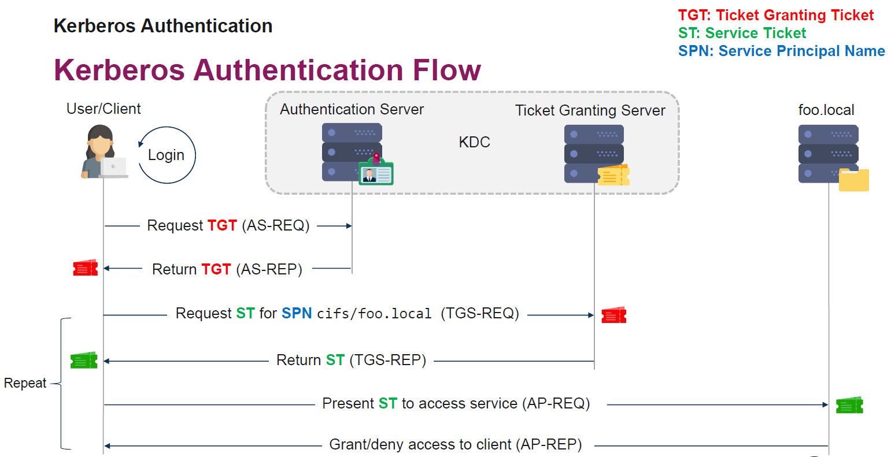

# Lateral Movement

## 1. NTLM Authzentication and Abuse
NTLM serves to provide authentication, integrity and confidentiality. Even though dated (using MD4), it is still available in modern windows and is used when: standalone server is not domain joined, kerberos is not supported, ip address is used, DNS fails. In practice it is hardly ever possible to disable NTLM. 
Possible attacks are: 
- pass-the-hash
- NTLM relay (man-in-the-middle)
- break NTLM hash (as not that strong)

## 2. Lateral Movement
Given we have the required credentials, an attacker can move laterally (aka execute malicious code on other machines) by various means: 
- Create a scheduled task (on remote system)`
    - `schtasks /create /s {IP} /tn {name} /u {user} /sc {frequency} /p {password} /st {time} /sd {date} {command}`
- Creating System services
    - `sc \\IP create Service binPath=<command>`
- PsExec
    - `psexec \\test.domain -u Domain\User -p Password ipconfig`
- WMI
    - `wmic /node:target.domain process call create "C:\Windows\System32\cmd.exe /c payload.exe"`
- Windows Remote Management (WinRM)
    - `winrs -r:EXAMPLE.lab.local -u:DOMAIN\user -p:password calc.exe`
    - `Invoke-Command -ComputerName TARGET -ScriptBlock { dir c:\ }` via powershell
- DCOM
    - DCOM is a way to execute code on a remote machine. (is less easily detected than default tools)
    - Examples see "06 Lateral Movement.pdf"
        - run a excel on another machine (and excel runs macro)
    - DCOM can also be used to start/stop services, get system info, shut down system etc.

**Double-Hop-Problem** -> with Network logons (like WMI, WinRM)
Network logons don't send credentials to remote system and are therefore not available. So it is not possible to jump to the next machine from there. Therefore, attacker needs to steal a token from a non-network logon session and then inject it in to another process (see pdf)

*Remark: some of the techniques can also be used for persistence*
*Remark: cobalt strike has various means for lateral movement*

**Port forwarding**
To bypass firewalls, prevent inspection,  prevent being detected..
- PuTTY Link (SSH tunneling of a specific port)
    `plink.exe -l root -pw pass123 [target host] -R localhost:3389:127.0.0.1:3389`
- Meterpreter  (forward RDP from localhost to a target host pivoting thru the Meterpreter session)
    - `portfwd add –l 3389 –p 3389 –r [target host]`
- also possible with cobalt strike
- Linux
    - `ssh -L localhost:3389:127.0.0.1:3389 root@[target host]` SSH tunneling of a specific port
    - `ssh -D 9050 root@[target host]` application-level port forwarding acting as SOCKS server

**SOCKS Pivoting**
a bit like attacker machine can access ethernet interface of victim machine (and could for example create RDP sessions)
see pdf (example: How to tunnel the Windows RDP client to your target network?)
can be done with Cobalt Strike or Metasploit

**Password Spraying & Reuse**
see separate file 

## 3. Kerberos Authentication and Abuse
Protocol for authentication, default authentication in windows. 

Building blocks
    - Authentication Server (AS)
        - basically returns a "Ticket Granting Ticket" (TGT) against credentials
    - Ticket Granting Server (TGS)
        - will provide a service ticket (ST) against a TGT for a particular service
            - ST is specific to a a service.
    - Services with "Service Principal Name" (SPN)
        - unique identifier of a service instance within the domain
        - Format: <service class>/<host>:<port>/<service name>
            - example: MSSQLSvc/ws1.winattacklab.local:1433
 
 

Some aspects: 
- ticket based
- mutual authentication (no man in the middle)
    - Example: sql server would authenticate via "MSSQLSvc/ws1.winattacklab.local:1433"
- based on shared secrets and  temporary session keys
    - example: (part) TGT is encrypted via with key of TG, so client cannot read it but pass it to TGS which can interpret it and knows that the TGT was actually handed out by the Authentication server (details see pdf)
- "krbtgt" Account
    - built-in account or the KDC service
    - is disabled (and cant be activated)
    - its hash is used to encrypt TGT's 
        - therefore like a masterkey 
        - password is not changed automatically (so many AD's in practice still have the same)
- account policy info is in the TGT (stateless)
    - can be abused when we are able to build golden/silver tickets (build working tickets with disabled)

**Overpass the hash** (aka pass-the-key) -> attack
Passing a stolen encryption key (Pre-Authentication data) to get a TGT for another user
Using the pre-authentication data ()
-> similar pass-the-hash for NTLM, just for kerberos

good explanation: https://www.whitehat.de/active-directory-hacking-angriffe-mit-mimikatz/pass-the-key-ptk-overpass-the-hash-oth

**Pass the ticket** -> attack
Steal tickets
    - steal "Ticket Granting Ticket" TGT 
    - steal service ticket (ST)
How to get the tickets: with local admin rights possible to dump them from LSASS
(can be done via tools like Mimikatz, Cobalt Strike, Rubeus)

**Golden tickets (and silver ticket)**  -> attack
    - forged ticket-granting tickets (TGTs)
    - When we just forge a service ticket (ST) it is called silver ticket
    - Since all account policies are passed in tickets, we can forge autorisation data
        - group memberships, account disabled etc.)
        - it used to be even possible with non-existing users (no longer possible though)
*Remark: AD security boundary is the forest, not the domain. So if we get a golden ticket for a domain.. we can compromise the entire forest (see powerpoint)

**Kerberoasting** -> attack (cracking ticket)
Background: every user can request a ticket for any service, even if user has no right to it. With such a ticket, the password for the service ticket can be cracked.
-> possible because service accounts might have weak passwords and use a weak algorithm by default (RC4). Machine accounts passwords are strong and use a strong ciphery (AES), so this is (normally) not possible.
1. Find a user/service account with a service principal name (SPN)
2. Request a service ticket with RC4_HMAC_MD5 encryption and extract a hash from it
    - if SPN is registered for a user/service account and not a machine account, the users pw might be weak
3. try crack password  (possible tools: hashcat, John the Ripper)
To avoid detection (OpSec considerations): dont just request service tickets for every user, ......
-> also see pdf

## 4. Persistance
How can an attacker keep a compromised machine when the machine is rebooted?
- Advantage: avoid re-compromising the machine
- Drawback: persistence could be detected
Aspects/Components:
- Payload: malicious code
- Payload storage: where to store it 
    - Alternate Data Streams
    - Custom WMI classes (WMI allows this)
    - Registry (stored as text)
- Code Execution Vectors: when/how to start it
    - User Driven
        - hidden in shortcut (.LNK)
            - example using regsvr32.exe and malware dll passed as argument
        - Backdor common .exe

Some ways 
- add code in startup folder (easy to detect)
- registry to trigger start of application
- shortcut -> when user clicks malware starts (or a download of the software can be triggered.. etc.)
- scheduled tasks
    - Linux: cronjobs (or something like this)
- etc.

## 5. Red Team War Stories

## 6. Recap

