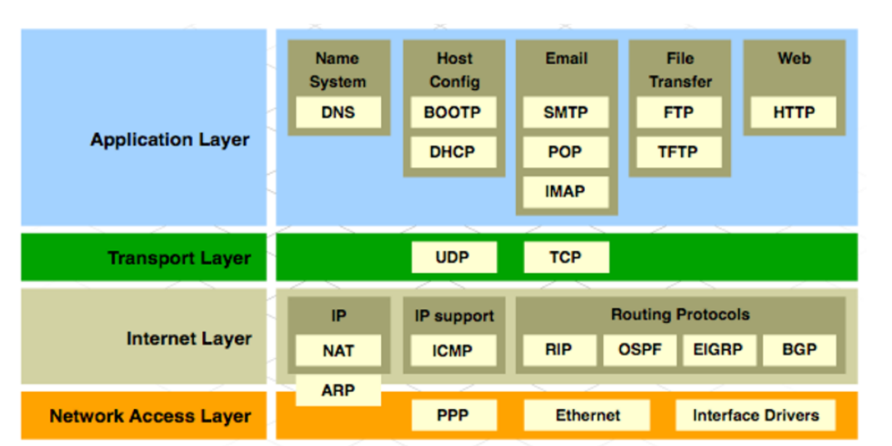
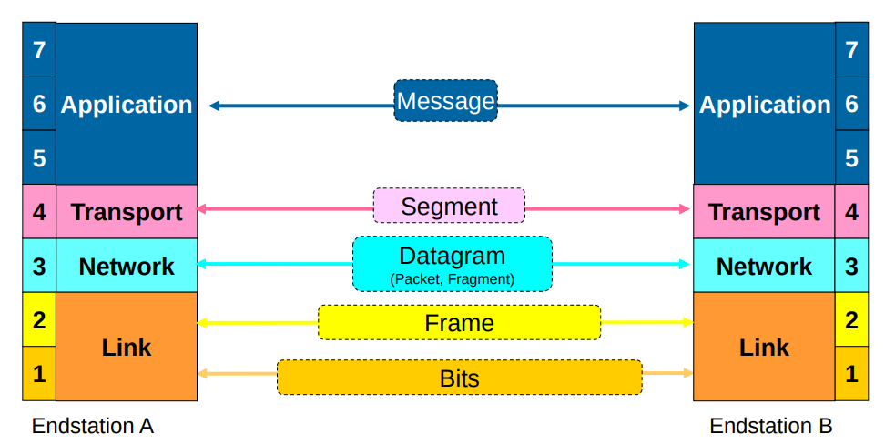

# Internet protocolls

### Networking fundamentals

- computers
  - tools: ssh, ftp, telnet, ping, traceroute
- content (via browser, http(s))
- People (social networks such as fb)
- things
  - MQTT (Message Queuing Telemetry transport)
  - Coap (Contraint application protocol)
  - DDS (data distribution service)
  - others (XMPP)
- Values (blockchains such as bitcoin, ethereum ) ??
- Life -> human machine interaction ???

Communication types
- Simplex -> one way
- half duplex -> both ways but never the same time (walkie-talkie)
- Duplex -> both ways (e.g. telephone)

Communication types 2
- Peer to peer  (point to point)
- Any to any (peer to peer networks)
- Multicast (broadcast)  (e.g. radio)

### OSI

7 Layers but often 5-7 are treated as one (application layer).

ARP: allows to map IP to MAC addresses.

Layers a bit more detailed. Naming is a lot like in Wireshark (e.g. frame)

### Border Gateway Protocol (BGP)
AS = Autonomous system. Part of the network (internet) that is under the same administrative domain (provider). An autonomous system has routers connecting it to another network. These routers usually implement the BGP protocol. (It is possible that there autonomous systems within an autonomous systems)
  - ASN: AS-numbers (originally 2 bytes, extension to 4 bytes)
    - Public AS -> are assigned a number: 1 - 64511 (2 bytes)
    - Private AS -> 64512 - 65535  (reserverd for private use, similar to private IP's)

Some terms
- EGP = Exterior gateway protocol -> BGP is the most commonly used type of EGP
  - example: BGB
- IBGP = Interior Border gateway protocol (forwards packets to another IBGP within the AS, which could implemnet EBGP as well)
  - examples:: OSPF, IS-IS
- EBGP = Exterior Border gateway protocol (forwards packets to routers (EBGP) of other autonomous systems )
  - used to exchange routing info between ISP's (Internet service providers)
  - ASN = 
BGP routers exchanging routing info via TCP connection (via Port 179) are called BPG peers (or neighbours). BGP uses various steps (11 steps) to determine best path. 

Originaly, while internet was initially thought to be hierarchical, by now AS connected more or less randomly to other AS (via BGP)

TODO go a bit deeper + add stuff about single-homed, dual homed etc. 

Links
- https://de.wikipedia.org/wiki/Border_Gateway_Protocol
- good video BGB: https://www.youtube.com/watch?v=LUmajjJEq24 