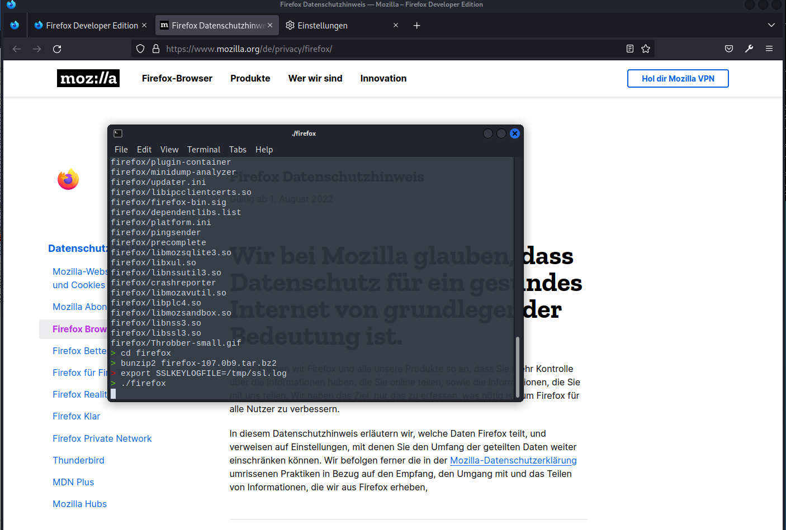
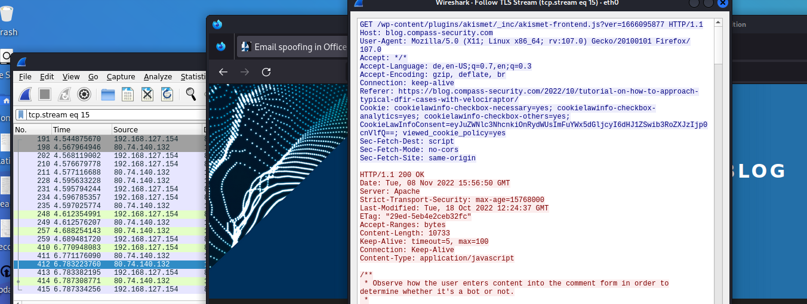

# TLS - SSLKEYLOGFILE with Chrome

Some browsers (Chrome, FF) can write their SSL key into a log file that can then be used by Wireshark to decrypt TSL connections.

https://firefox-source-docs.mozilla.org/security/nss/legacy/key_log_format/index.html 

### Basic workflow using Firefox (ANSWER)
1. Open xfce4 terminal as non-root, vuia Usual Applications > System  (maybe normal bash also works)
2. Download and unpack Firefox developer edition (`bunzip2 firefox-107.0b9.tar.bz2 ` and `tar -xvf firefox-107.0b9.tar`)
3. In firefox directory: `export SSLKEYLOGFILE=/tmp/ssl.log`  -> set and export the SSLKEYLOGFILE variable (attention, this is from overall base folder "/")
4. Start Firefox  `.firefox`  (from same terminal)
    - now there should be an ssl.log in configured folder
5. Start wireshark and ensure the ssl.log file points to the file we configured as SSLKEYLOGFILE variable
    - Preferences > Protocol > TLS > "(pre)-Master-Secret log filename > "/tmp/ssl.log"
6. Browse https sites in chrome (e.g. "https://blog.compass-security.com")
7. Check in Wireshark: Wireshark should now decrypt TLS
    - Tip: use the "follow TLS stream" feature

**Terminal after setting environment variable and starting FF**

**Decryption example with Wireshark and FF** (see HTTP header)

TLS decrpytion works in FF (see screenshot)

### Basic workflow using chrome
1. Open xfce4 terminal as non-root, vuia Usual Applications > System  (maybe normal bash also works)
2. `export SSLKEYLOGFILE=/tmp/ssl.log`  -> set and export the SSLKEYLOGFILE variable (attention, this is from overall base folder "/")
3. Start chrome `/usr/bin/google-chrome-stable`  (from same terminal)
    - now there should be an ssl.log in configured folder
4. Start wireshark and set the ssl.log file and then capture
    - Preferences > Protocol > TLS > "(pre)-Master-Secret log filename > "/tmp/ssl.log"
5. Browse https sites in chrome (e.g. "https://www.hacking-lab.com/events/")
6. Check in Wireshark: Wireshark should now decrypt TLS

    ### Varia
- xfce4-terminal: xfce4-terminal emulates the xterm application developed by the X Consortium
- Browser (Chrome/FF) has to be started from the terminal we set the environment variable as otherwise it would not access write to the SSKEYLOG file we set in "SSLKEYLOGFILE". (and we configure exactly this file in Wireshark)