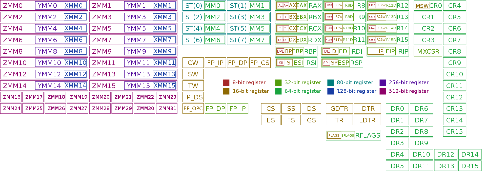
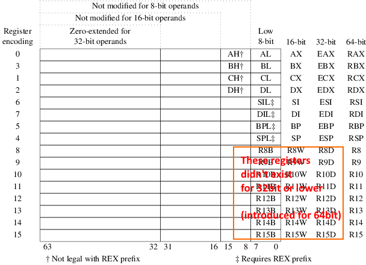
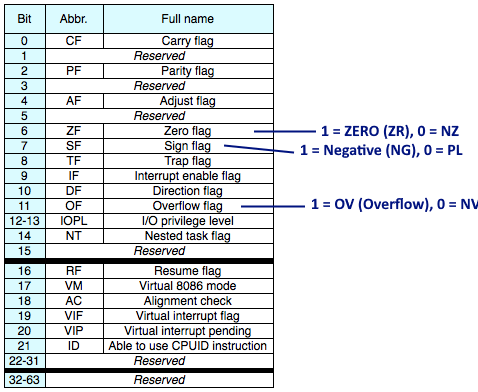
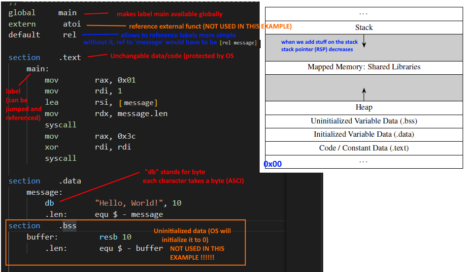

# Assembly

Basic links: 
- https://en.wikipedia.org/wiki/X86-64
- https://de.wikipedia.org/wiki/X64
- https://datacadamia.com/lang/assembly/assembly
- https://learn.microsoft.com/en-us/windows-hardware/drivers/debugger/x86-instructions
- http://www.mathemainzel.info/files/x86asmref.html

x86 64 bit assembler 
- https://cs.brown.edu/courses/cs033/docs/guides/x64_cheatsheet.pdf 

NASM (Netwide assembler) on linux
- https://www.nasm.us/ NASM
- https://filippo.io/linux-syscall-table/ (System calls on linux)
- https://en.wikipedia.org/wiki/X86_instruction_listings instructions
- https://www.felixcloutier.com/x86/ (also instructions)
- https://faydoc.tripod.com/cpu/jc.htm  (instructions...good for jump instructions)


## Registers

**Overview**
Numerous registers exists (source wikipedia):



**Integer and specific register**


Some special registers: 
    - RBP Stack base pointer (base pointer)
    - RSP Current base pointer (to the end)
    - Instruction pointer: There has to be some kind of register that points to the next instruction (jump instructions like jmp, ja, jl etc. will change the pointer value in this register). Probably named IP (not visible in integer register). Probable not possible to access directly.


**Floating point**
16 registers that are 512bit wide: ZMM0 - ZMM15. 
It is possible to only addres 256 or just 128 bit. Example: YMM8. 

Original 64 bit floating point registers are still available. Example: MM0 - MM7


(Details see Programming_Funcamentals_Concept.pdf)

**Flags**

Whenever an instruction is executed, the CPU sets flags  based on the result of the instruction



https://en.wikipedia.org/wiki/FLAGS_register

Example with flags and conditions: 

``` 
        ...
        cmp         rax, 3 ;sets flags depending on result RAX-3 
                           ; ja: jumps to someLabel if value above (depending on flag). 
        ja          someLabel 
        ...                ; if no jump, execution continues here
    someLabel:
        mov         rsi, 8
```

## Basic assembly program



*Remark: by today (aka in modern OS) pretty musch all memory is virtual memory* 

### Command line arguments, external calls, calling conventions

**Arguments**
Example argument in C
``` 
int main(int argc, char *argv[])
{
    // argc -> argument count (minimumn 1 as the first argument argv[0] is the name of the program)
    // argv -> actual arguments
    // some c code
``` 
In assembler the command line arguments work similarly in Linux: 
- Register "RDI" -> count of arguments (argc)
- Register "RSI" -> pointer to the first argument in memory (program name)

*Remark: under Windows it would be the registers "RCX" and "RDX"*

**Calling conventions**
When we call a function (external code) there is a convention no how to pass arguments and recieve the return value. The convention is based on the OS, here we only look at Linux. The first arguments are passed via registers: RDI, RSI, RDX, RCX R8, R9 (in this order). If there are more arguments, they are pushed on the stack (first arg not on the stack is pushed last so it can be access first.. thats how a stack works)

Calling conventions are used for system calls (instruction "syscall"), our own methods and external code assuming the external code adheres to the calling convention (probably no other cases???)


**Example arguments and external code** 
``` 
....
extern      atoi  ; reference to external call (C function)
default     rel

section     .text
    main:
        cmp         rdi, 2 ; rdi contains nof arguments
                           ; rdi-2 -> sets flags 
        jl          exit ; jumps to exit if rdi-2 was below 0
                         ; (SF flag set) -> exit if no arguments passed
    initialize:           ; argumetns passed
        push        rbx ; save value of "rbx"
        mov         rdi, [rsi + 8] ; move pointer to second argument to rdi
                         ; first argument would be filename
                         ; +8 because we are on a 64bit system
        call        atoi wrt ..plt  ; call c function atoi 
                        ; will take value in memory at location rdi 
                        (second arg) and convert asci string 
                        in that memory till '\o' is found in an 
                        integer and write it to register RAX
                        ; "wrt ..plt" -> info for linker (not fully clear :-( ))

    jump:
        cmp         rax, 3  ; Check register RAX containing the result of atoi and set flags (most probably to jump) 
        ....

``` 


## Instructions

Examples instructions
- `MOV dst src` -> moves data from source to destiation
    - src can be pointers to memory, registers, constants
    - dst can be pointers to memory + registers (some registers are excluded)
- `MOV eax, [1234]` -> [1234] is a pointer here and it means we want to move the value that is in memory addres to be moved to eax
- `LEA rsi [someLabel]` -> moves/loads the memory address into rsi   


## Leftovers

- Size (for constant declaratiosn)
    - "db": byte ->  one-byte integer
    - "dw"  WORD ->  two-byte integer (16bit)
    - "dd"  DOUBLEWORD (DWORD) -> four-byte integer (32bit)
    - "dq" -> QUADWORD (QWORD) -> eight-byte integer (64bit)
        - The size of a register (e.g. "RDI")
- Values in memory are in little endian format. 
    - Example hex number: 4F52 
        - little endian:  52 4F
            - 52 at addresse 1000, 4f at address 1001
            - used by x86 CPU's
        - big endian (intuitive):  4F 52
- How the values are to be interpreted depends on depends on the programmer
    - Unsigned or signed  (signed means the 1 bit defines whether it is minus or not)
        - How values are treated depends on instruction. 
            - Example: `ADD` is for signed, `ADCX` for unsigned values
        - Flags:  Overflow is for signed, Carry flag is for unsigned (not 100% sure, which flags are set depends on the instruction anyway)

*Remark: Theoretically the size of a word could depend on the unit the processor could process in one step or in some cases (programming languages) on the context. * 


## Questions

In regards to examples and concept pdf.

**Question 1 Stackframes**
9.5.4.2 Stack Frames
-> in the graphics, it seems that RBP and RSP both seemed to have increased (actually decreased as stack grows downwards)
   -> why? I understand why they both point to the same location (no more args) but
      shouldn't the stack become smaller again?

Answer and notes: (more or less)
- RBP + RSP are set again when code in a method calls another method (and value is safed on stack as well I believe) 
- threading: each thread has is own stack (is virtualized anyway)


**Question constants (verification)**
9.5.5.1 Constants and variables
``` 
    constmsg:
        db "Hi right back!", 0xA
``` 
"db" byte  (8bit)  
I assume that means each character takes 8 bit (ASCI)
Anwer: yes.. each character takes 8 bit


**Question 3 .bss section**
9.5.5.1 Constants and variables
``` 
section     .bss
    message: 
        resb    10
``` 
What does resb mean?
Answer: "resb" reserves the memory (a bit like malloc)
