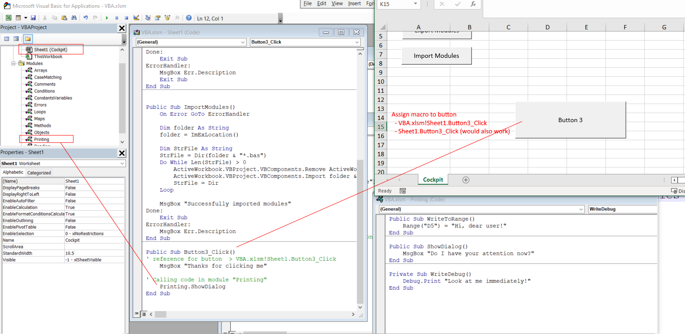

# Visual basics Notes

Visual basics comes in different flavors: 
- ASP -> web development in IIS (legacy)
- VB.NET -> VB syntax but otherwise a lot like C# since it it part of the .Net framework (legacy)
- Excel (and other office)
- others... (Report builder for sql server.. potentially legacy )

This document only refers to Visual Basic running in Excel. 

## Visual basic Setup

Precondition: Excel is installed

**Configure Excel Ribbon (same for WORD)**
1. Open excel
2. Open: File > Options > Customize Ribbon
3. Under main Tabs, check "Developer"
4. In the "new" devloper tab, click on "Visual Basic"
    - Dev Window opens

**Additional adjustments**
In Excel do the following: 
- Enable "VBA project object model"
    - in Developer tab > Macro Security > Macro Settings > check "Trust access to the "Trust access to the VBA project object model"
        -  *Remark: in some versions of excel it might be: "Preferences" > "Security" > "Developer Macro Settings"*
enable "Trust access to the VBA project object model"
In the Macro editor (which opens when you click on "Visual Basic" in developer tab in excel): 
- "Tools" > "References" enable "Microsoft Visual Basic for Applications Extensibility"

## first macro using VB
1. In developer tab > insert (Form controls) > button
    - drag and insert the button
2. Int the "Assign Macro" pop up one can assign a macro if there is one already. For now we go with what is proposed (something like: "Book1!Button1_Click")
3. Open Visual basic workbook and define a Sub in a sheet. (Usually "Sheet1")
    ```
    Public Sub Button1_Click()
        MsgBox "Hello"
    End Sub
    ```
4. Go back to the excel sheet, right click on the button > Assign Macro and choose the Sub defined before. It should be in the list to choose from with a name like: "Sheet1.Button1_Click" (depends on the names of the sheet and the Sub)


**Example (incl. usage of Sub in module)**




*Remark: macros can also be played/run from the Macro window just clicking play. It will propose the possible starting points


## Tips and tricks
- 'Debug.Print("I will write to immediate window')` > immediate window can be configured to be visible
- Type `Variant` can take any type. Example: `Dim x As Variant`
    - https://learn.microsoft.com/en-us/office/vba/language/reference/user-interface-help/variant-data-type
- `Dim myVarType = VarType(variableX) As VbVarType`
    - will return the type of a variable (helpful for debugging or when working with Variant). Attention: returns a number
        - mapping https://learn.microsoft.com/en-us/office/vba/language/reference/user-interface-help/vartype-function