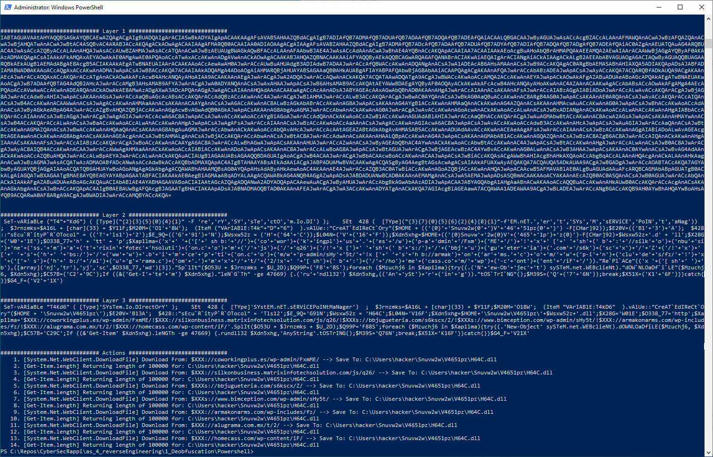

## Powershell deobfuscation with Cyberchef

Steps done with Cyberchef
1. decoded from base64
2. Removed 0 bytes (visible as punctuation)
    - To Hex
    - Replace 00 with empty string
    - From Hex
3. Improved string readability  (as far as I could tell this would not affect actual functionality)
    - to lowercase
    - replaced "`" with ""  (unnecessary characters)
    - undid string decomposition: replaced "'+'" with "" and similar via multiple find/replace  (regex would have worked too)
Other techniques used which were not solved with cybechef  (these steps I would solve manuall one by one)
- string formatting:  [type]("{2}{3}{5}{0}{4}{1}" -f 're','ry','sy','ste','cto','m.io.di')
- string changes (replace with values from array)
- null assignments 
- meaningless variable names. Exampler:  ;$xap1lma
- unnecessary language characters (e.g. brackets)
- run code in string (dynamic code, or at least thats how i interpret the code in strings)
- dead code

Next steps would be to manually look at parts of the code and deobfuscate it and if it is safe run parts of it to check (see codeSnippets.ps1)

What script does (my understandind)
1. Create a directory
2. Loops over an array of variables (which in the end will be urls) (all in a try/catch block so it will continue with next entry in case of failure)
    - download files and safe them to this directory
    - Run the file if bigger than 47669 bytes(?) via rundll
    -   https://www.cybereason.com/blog/rundll32-the-infamous-proxy-for-executing-malicious-code
    

## Deobfuscation with PSDecode

1. Step one: install PSDecode + cut internet connection in VM
2. Create file PowerShellinput.ps1 which contains the base64 encoded part of "PowerShellInput.txt" (the actual powershell part)
3. Run `PSDecode .\PowerShellInput.ps1` 
4. Analyze
5. Reconnect VM to internet (and rename malicious ps1 files so they wont be executed by accident)

Output of 

(also see PSDecodedOutput.txt)

**Answers**
1. Use PSDecode to analyze the above mentioned code. Compare with the result of your manual
analysis.
    - it goes a few step further than what I have achieved with Cyberchef
        - The software seems to work in rounds (round 1: base64 decoding, round 2 string obfuscating tricks like string formatting resolved etc., round 3: actions)
        - By actually executing the actions: we see the parameters passed. 
    - Generally, PSDecode was superior to my puny effort even if I could tell (guess) that the downloaded files would be executed as well.
2. Where did the automated analysis fail? Any idea why?
    - Failes at: `([array]('nj','tr'),'yj','sc',$O338_77,'wd')[3]`  (which basically comes down to the value of "$O338_77" which is 'http')
        - (actually luckily as this way nothing is actually downloaded)
        - Not sure why: is it because the relevant code was obfuscated code was .net and not really powershell? (it looks like .Net string/array manipulation) 
3. Can you overcome this and manually figure out what the malware does?
    - yes, i executed the failing part manually which resulted in "http" (didnt actually do this as )

## Notes/Varia
https://www.csnp.org/post/cyberchef-data-decoding-made-easy