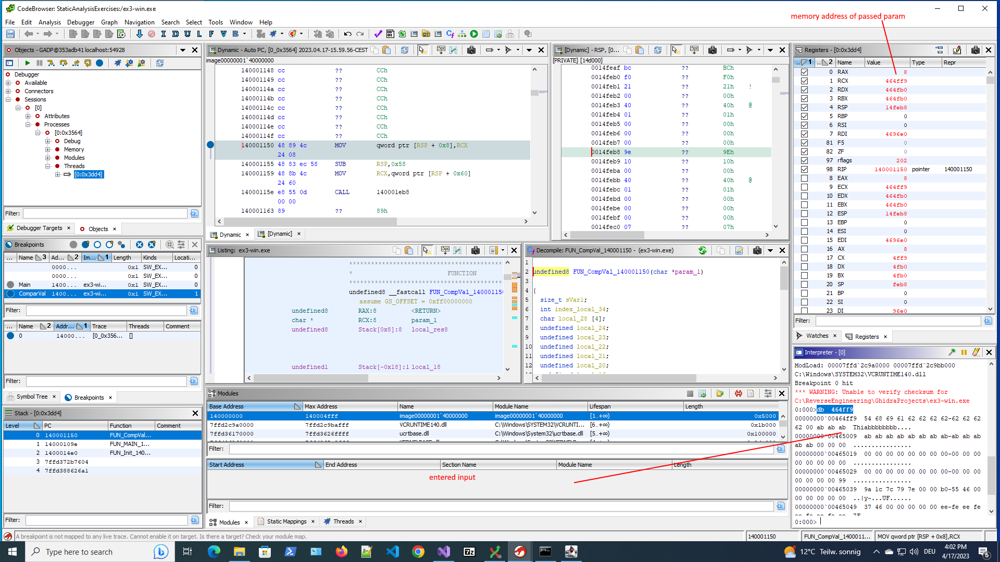

# Dynamic analysis 


## First stepss

**4.2 Running a programm**

1. Inspect the “Dynamic Listing” component and compare it to the static “Listing” component. Why are they showing completely different memory locations?
    - Static Listing:     140000000  (Beginning of mapped addresses)
    - Dynamic Listing:        7ffa700e2680 48 83 ec 78     SUB        RSP,0x78   (Address of register RIP)
    - Answer: static listing shows the beginnning of the mapped memory addresses, basically where the actual file starts, whereas the dynamic listing shows the first code that is executed (see register RIP). 

<span style="color:red">What are the registers EIP, and or IP ??? Are these 32 bit subsets?</span>

2. Have a look at the “Registers” component. Where are the instruction pointer and stack pointer pointing? Where can you find these memory locations?
    - RIP (instruction pointer): 7ff700e2680 -> points to where we jumped to in the dynamic listing
    - Stack
        - RBP Stack base pointer (base pointer): 0
            - however, first instruction will change it's value
        - RSP Current base pointer: 14ffd8
            - not sure what this means
3. What is displayed in the “Stack” component?
    - The starting point address of the dynamic listing (7ffa700e260). The point where we actually start debugging


**4.2.1 Suspending at a known location**

Main function: `FUN_140001060` renamed to `FUN_MAIN_140001060`

1. How do the “Dynamic Listing” and the static “Listing” components present now? Why is it different
from before?
    - dynamic listings
        - I mainly just see the actual assembly code
        - I see the registers actually being used: `MOV qword ptr [RSP + 0x10], RDX`
    - static listing:
            - I get some additional information regarding parameters, function, stack values (local_res)
        -  I see label names, argument names etc:  `MOV qword ptr [RSP + local_res10], param_2`
    - Conclusion: it is best to have both, static and dynamic listing open at the same time as they complement each other
2. How is the “Stack” component changed? What happens if you click on the different lines presented
there?
    - The stack components shows the different stack frames. For ex3-win.exe 4 stack frames are shown, the last 2 can be mapped to a function (last is current main function)
    - Upon clicking on a line, we jump to the dynamic listing (tracking the program counter) and the static listing jump to the corresponding code (not the address in the stack). The register only show values for the current stack frame (or better current execution) as they values for the previous states are lost/overwritten. 
3. Where can you find the values for argc / argv? What are these? Can you find the argument you
passed based on these?
    - In my example, I passed one string argument so in a C program I end up with 2 arguments: argc and a char array with 2 entries ("program name" and "customValue").
    - Using the static listing (and to a lesser degree the compiled C code), i quickly find the assembly code that uses or references the arguments. Once I found these places, i check the corresponding code lines in the dynamic listing and find the registers or memory addresses these values should be. 
        - argc (in C) -> param_1 in static listing -> register RCX in dynamic listing -> value "2"
        - param_2 (char array in C) > pointer in RDX to (534fa0) -> in Interpreter i can see the memory values 
4. How do you go about finding the actual text values passed to the program?
    - in Interpreter `db 534fa0`  (534fa0 being the address in register RDX)
        - since a char is only 1 byte, "db" is the correct keyword to query the memory here. 


**4.2.2 Stepping**
Advancing program to method comparing eky
1. How would you go about finding the expected value (without modifying program state - we only
learn about that later ;-))?
    - Firstly, I would statically analyze the code, especially the decompiled C code rename some variables (static analysis)
        - it seems that we have to find a string and that there has been some obfuscation
        - there is one crucial if statement which defines whether we got the right character or not
    - Secondly, I try to find the crucial if statement in assembly (CMP statement) and I set a breakpoint there: `CMP        EAX,param_1`
        - In the register EAX has to be the value for the character that is compared to my input, so I can use the register value to find out a valid input. I set a breakpoint exactly at this point. 
    - I work in rounds now: I start debugging with a certain input string, continue untill my breakpoint at the compare statement is hit and read the correct value from the register EAX to get the first valid character. I restart debugging - round 2 - but this time I make sure my input string starts with the first valid character (value from EAX as ASCI string) I again continue till I hit the breakpoint, but this time i continue again to hit the same breakpoint again (second loop in while) so I get the second character. I do another round to get the third character.
2. Get the first three correct characters.
    - Value in register EAX when comparing: "Thi"
        - [1]  -> 54  -> "T"
        - [2]  -> 68  -> "h"
        - [3]  -> 69  -> "i"

**4.2.3 Modifying Register Values**

1. Using this new way of “tricking” the program, how can you go about finding the entire expected
value?
    - I (probably) find the key by just using the approach used in 4.2.2 with restarting the program each time we found another valid character. However, it is probably much faster if we just change the register values aka register flag while debugging, so we can find the entire key in one debugging session.
        ```
        CMP EAX, param_1        ;  actual assembly:  CMP RAX, RCX
        JZ  LAB_140001236       ; -> will jump if zero (so will jump if RAX and RCX are the same)
        ```
    - I set the break point to the jump instruction and each time we get there, I write down the value in RAX (EAX) and I make sure that the value in RCX matches the one in RAX - by modifying the register in Ghidra - in order to get to the next "round" when i click on "Resume" debugging.
    - *Remark: i tried to modify the ZF flag register as I thought RAX might be used at some point later and by just modifying the flag register, we reduce such a chance. However, this didn't work and ZF is usually greyed out, which probably means not the correct value is shown anyway. (Maybe it would be possible to change the zf value by modifying the "flags" but I didnt try this.)*

2. Do it! What’s the key?
    - Using the approach described above: i get the following numbers: 
        - 54,68,69,73,5f
        - These result in the following string: "This_" 

**4.2.4 Modifying Memory**
From the decompiled code (and fastcall convention) we get that the memory address of the passed string is to be found in the register RCX (464ff9). We can query this memory address via `db 464ff9` (see screenshot below). However, this doesn't help us much as we don't want to change the entered arguments but we want the program to trick into accepting them so we find out the accepted value.



Having a look at the generated assembly we find the statement that fills the RAX register with the value from the stack
        ```
        MOVSX  RAX, byte ptr [RSP + 0x20] ; this is the statement that moves value from stack into RAX which is later used for comparison
        .... ; some other code
        CMP RAX, RCX         ;  actual assembly:  CMP RAX, RCX  in static listing:  "CMP EAX, param_1"     
        JZ  LAB_140001236       ; -> will jump if zero (so will jump if RAX and RCX are the same)
        ```
By executing `db 14fe80` (mem address calculated via value in RSP + 0x20) we see the that the byte at the corresponding position that we have to manipulate as it will be later loaded into the register RAX and used for comparison. 
Example:  `eb 14fe80 41` I set the value to 41 (in ASCI 'A') to the corresponding memory address. So by alligning this with what I have passed as an argument, i can pass the check and go to the next round. 

So what I have to with this approach is:
1. set a breakpoint 'MOVSX' statement and wait till breakpoint is hit
2. read value from stack (RSP + 0x20) that respresents the character: `db 14fe80`. Remember this value as this is the valid character.
3. overwrite this value with the character at this index which I have passed as Input. Example: `eb 14fe80 41`  (I have passed "Ablablabla" and we are in the first round so I have to set the character "A", which is 41 in HEX)
4. resume debugging and repeat the steps untill we have the keyword

*Remark: for this particular case, I found overwriting the registers as in step 4.2.3 more efficient* 


Info about MOVSX instruction (mainly just reading one byte and loading it into register): 
    - https://en.wikipedia.org/wiki/X86_instruction_listings
    - https://stackoverflow.com/questions/33268906/how-does-movsx-assembly-instruction-work (more detailed)

Info/Examples on how to use interpreter to read/modify memory
    - example: `dq 14fff0` -> shows content of memory  (quad, attention big endian)
    - example: `ed 14fff0 01` -> edits content of memory (quad)
    - example: `eb 14fff0 01` -> edits content of memory (byte)
    - example: `db 14fff0` -> show content of memory (byte)
    - example: `dd 14fff0` -> show content of memory (double word)


**4.3 Patching Programs**
Making the program accept any input. 

Original instructions 
```
 CMP EAX, param_1        ;  actual assembly:  CMP RAX, RCX
 JZ  LAB_140001236       ; -> will jump if zero (so will jump if RAX and RCX are the same)
```
By replacing the "JZ" instruction which will only jump when the zero flag is set with "JMP", which will always jump, our program will acceppt any input. 

```
 CMP EAX, param_1        ;  no changes
 JMP  LAB_140001236       ; will always jump to address
```

To test: 
Export file via “File” > “Export Program”, selecting “Format”: “Binary”  (exported filename ends with ".bin"). Run as an exe (remove .bin extension) it and it will acceppt any input. :-) 


## Input from Sprechstunde

- layouting: splitting windows -> by drag & drop
- bind dynamic listing to stack?`(check video beginning .. 6:50)
- explanation about pointer to pointer ...

- Stack register RBP 
    - RBP is usually (always?) set by hand so it's ok if it is initially 0
    - RBP is (can be) used to save RSP 
        - per convention: first thing to do is save RSP to RBP so when function call is finished we can just reset value 
        - however: compiler might do things differently and also possible that compile optimizes stuff so we don't see this


Link to video: https://ostch.sharepoint.com/teams/TS-CASCyberSecurity20222023/_layouts/15/stream.aspx?id=%2Fteams%2FTS%2DCASCyberSecurity20222023%2FFreigegebene%20Dokumente%2FGeneral%2FRecordings%2FBesprechung%20in%20%E2%80%9EAllgemein%E2%80%9C%2D20230404%5F170218%2DBesprechungsaufzeichnung%2Emp4


**Little and big endian (little endian used by x86 CPU)**
Example hex number: 4F52 
    - big endian (intuitive):  4F 52
    - little endian:  52 4F
        - 52 at addresse 1000, 4f at address 1001
        - used by x86 CPU's


**Memory size definitions**
- Byte:  db byte 1 byte / 8 bit
- Word:  dw word 2 bytes / 16 bits
- Double:  word dd dword 4 bytes / 32 bits
- Quadword:  dq qword 8 bytes / 64 bits

**Assembly examples**
Examples instructions
- `MOV dst src` -> moves data from source to destiation
    - src can be pointers to memory, registers, constants
    - dst can be pointers to memory + registers (some registers are excluded)
- `LEA rsi [someLabel]` -> moves/loads the memory address into rsi   