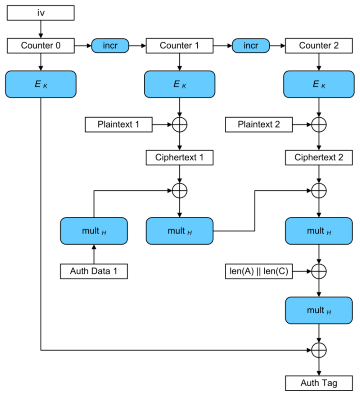

# 3 block ciphers

### Questions & Answers

1. The design of block ciphers must achieve confusion and diffusion. Please explain the two terms based on Crypto Intro and How to Break It.pdf, Slide 10 or Wikipedia, Confusion and Diffusion
    - Confusion: hides the relationship between key and ciphertext. Each bit of the cybertext depends on several (all?) parts of the key. This "confuses" the relationship between key and cybertext. 
    - Diffusion: Hides the statistical relationship between plain- and cybertext: if we change a bit in the plaintext, about half the bits in the cybertext should change. Diffusion ensures pattersn in the plaintext are not apparent in the cybertext.

2. Name two approaches to design a block cipher and give examples of algorithms for each (e.g. think of DES and AES).
    - Substitution-permutation networks: AES
        - multiple rounds are applied on a block: first substitute and then permuatate the data.  
    - Feistel cipher: DES

3. Block ciphers use a block mode to encrypt larger portions of plaintext. I need you to compare these block modes: ECB, CBC, GCM. Hints are listed in the ECRYPT-CSA-D5.4-FinalAlgKeySizeProtocolsReport-2018.pdf that outlines common block modes. Foreach block mode mentioned, please
    1. study the scheme that outlines encryption and decryption, concatenation as well as inputs and outputs. See Wikipedia, Block Modes
    2. provide details on their behavior (message dependence, IV handling, error propagation, padding requirements)
    3. name problems that could arise when wrongly using the mode. These are mentioned in the ECRYPT-CSA-D5.4-FinalAlgKeySizeProtocolsReport-2018.pdf paper.

    - **ECB**  (Electronic code book)
        - 
        - for confidentiality only. Not fully secure (lack of diffusion)
        - message dependence: None
        - IV handling: none
        - error propagation: none (as blocks are independent)
        - padding requirements: final block needs padding to ensure block is filled
    - **CBC**  (Cipher block chaining)
        - 
        - for confidentiality only
        - message dependence: yes (result of one block is input to the next)
        - IV handling: yes 
        - error propagation: transmission errors in one block will also make the next block unencryptable
        - padding requirements: final block needs padding to ensure block is filled
    - **GCM** (Calois/counter mode)
        - 
        -  combines the counter mode of encryption with the Galois mode of authentication. > for confidentiality and authenticity. (Stream cipher according to wikipedia..)
        - message dependence: no (or only for Auth tag) 
        - IV handling: yes, needed
        - error propagation: not sure.. i believe not but Auth Tag will be wrong if bit is erroneously swapped
        - padding requirements: not needed like most block (all?) (not sure)

4. What do you do with plaintext that does not fit a multiple of the block size? Read on Wikipedia, Padding (cryptography)
    - for some modes (e.g. CBC, ECB) the last block has to padded in order for the input (plaintext) reaches the size of a multiple of the block size. Simplest way is to add null bytes but other ways are possible. 

### Notes 

Block cipher modes (is about how the relationship of the encrypted blocks)  
- ECB Electronic code book
- CBC Cipher block chaining
- CTR Counter mode
- GCM Galois/counter mode  (see above)
- etc..
- see: 
    - https://www.tutorialspoint.com/cryptography/block_cipher_modes_of_operation
    - https://www.cs.columbia.edu/~smb/classes/f20/l_crypto-3-modes.pdf
    - https://ost.hacking-lab.com/api/media/challenge/pdf/77b5dd78-0b4d-4854-92e9-862a1911f5c3.pdf
    - https://en.wikipedia.org/wiki/Block_cipher_mode_of_operation

- IV (Initialization vector): cryptographic primitive/input to provide the initial state, usually a random (or pseudorandom) number
- MAC message authentication code
    - To the ciphertext a MAC is added: a hash constructed from plaintext/key/cipher (various ways possible but it cannot be just a simple hash of the plaintext as key and/or ciphertext need to be a component to ensure integrity )
        - https://en.wikipedia.org/wiki/Authenticated_encryption