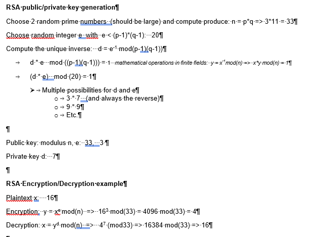
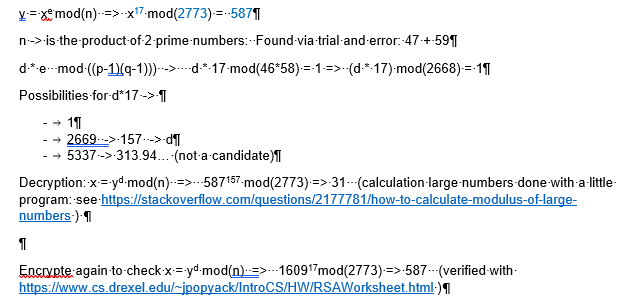

# 4 Public key algorithms

### Questions & Answers

1. Symmetric ciphers rely on shared secrets and thus lack the convenience of key distribution that comes with public key algorithms. Can you think of problems that still remain unsolved? Maybe read through Wikipedia, Public-key Crypto, Alteration of Public Keys first.
    - Man in the middle is still possible. (in the web we use certificates that can be checked using preinstalled certificates of a CA, that we (have to) trust) 

2. The class of public key algorithms make use of so-called "hard problems" to assure that private keys cannot be calculated from public keys. The problems are basically a kind of one-way functions. Easy to calculate in one direction but hard to reverse. Describe the two popular "hard problems" in simple words and give an example of an algorithm or protocol that makes use of it.
    - Integer factorization (used by RSA)
        - e.g: 2 large prime numbers are multiplied to the result "LP". It is hard to find out which 2 prime numbers "LP" is based on.
    - Discrete log problme:  (Diffie-Hellman key exchange)
            - given a + b, find integer k so a = $(b powered by k)

3. RSA is by far the most popular public key algorithm. That said, you are expected to describe the key setup (components and criteria) as well as the encryption and decryption formulas. Make a simple example with very small numbers. Follow the guide at Wikipedia, RSA (cryptosystem).
    - *I wrote it down in word and inserted it as image as markdown support for math is limited in my tool*
    -  
    - rsa calculator: https://www.cs.drexel.edu/~jpopyack/IntroCS/HW/RSAWorksheet.html 

4. OPTIONAL Do the same for ElGamal. Follow the guide at Wikipedia, ElGamal(encryption).
    - skipped :-( )

5. Alice sent Bob an encrypted number: 587. Mallory has intercepted the message and also holds a copy of Bob's RSA public key (n,e 2773,17). Proof that small hard problems are not hard and calculate the plaintext number.
    - Answer: plaintext: "31"  and d is "157"
    -  

6. OPTIONAL The Diffie-Hellman key agreement protocol is an early follower of the public key algorithm idea.
    1. How does the protocol work? Use Alice and Bob as parties.  
        - skipped as I'm a bit short of time :-( 
    2. What is the public and what is the private key composed of?
        - skipped as I'm a bit short of time :-( 
    3. Assuming Mallory is in the position to rely and alter communication. Could you describe an attack that may allow interception of traffic?
        - man in the middle 
