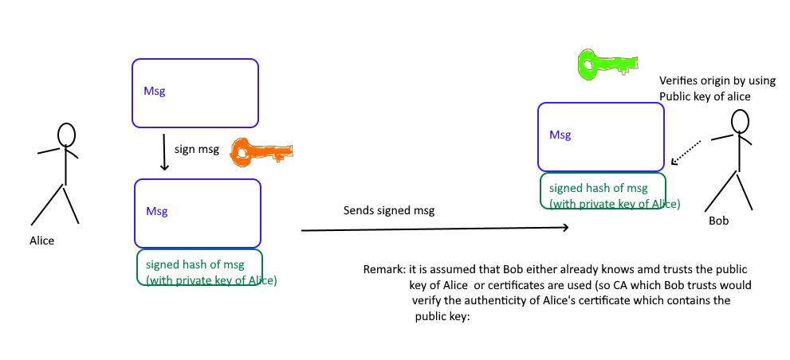

# Digital signatures

### Questions and answers

1. What does "non-repudiation of origin" and "non-repudiation of receipt" mean?
    - "non-repudiation of origin" -> the sender (origin) can be proven. 
    - "non-repudiation of receipt" -> it can be proven that the receiver has actually received the message. (How? maybe by responding with a digitally signed message which contains the previous msg (or parts, hash etc.))

2. Draw a simple signature scheme for the creation and verification of digital signatures. Label all relevant components and processes and explain how creation and verification basically works?
    - 
        1.  A hash is computed over the plaintext message and then the hash is encrpted with the private key of Alice. Message is then sent to Bob
        2. Bob receives the msg and decypts the signature with the public key of Alice and recieves the plain hash of the message. He then hashes the message himself and compares "his" computed hash which the encrypted one which was sent by Alice (as part of the signature). If both are equal, Bob knows that the message was sent from Alice and was not altered. 

3. Name three algorithms that could be used to create and verify signatures?
    - A hash function/algorithm to create the hash that is to be signed: MD5 (obsolete), SHA-1, SHA-256
        - It would be possible to encrypt (sign) the entire document but usually just the hash is encrpyted
    - public key/cryptography to encrypt the hash with the private key: RSA, DSA, EXDSA (Elliptic curve digital signature algorithm)

4. OPTIONAL You asked me for my favourite colour. Can you verify which is my favourite colour using gpg - GNU Privacy Guard on your live CD?
    - blue.txt
    - blue.sig
    - red.txt
    - red.sig
    - cyrill.pub
might try this one later...

### Leftovers

Digital signatures offer: 
- authentication (verify sender)
- integrity (no one has changed)
- non-repudiation (sender can be proven)