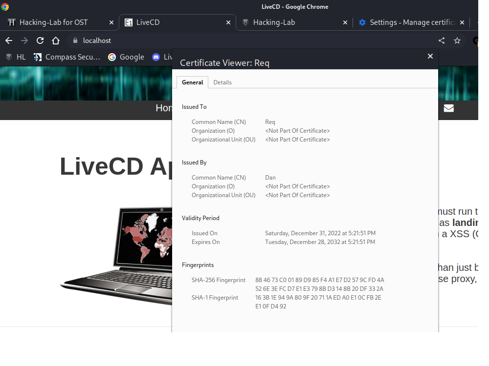

# Public key infrastructure

### Screenshots

Step 6 running appache 

Step 7 import CA

Step 8 Updated certificate with SAN

### Notes and varia

Step 5 Configure certs with Apache: entered the password upon restart, did NOT execute `./easyrsa set-rsa-pass localhost nopass`

Root CA (Step 2, Init PKI): 
- PEM pass phrase:   Dan123
- CommonName: Dan

Localhost server cert
- PEM pass phrase:  Req123
- Common name: Req

Client cert ( abusing the email as I am semiblindly following the steps: cyrill.brunschwiler@compass-security.com)
- Cyr123
- Common name: Cyr