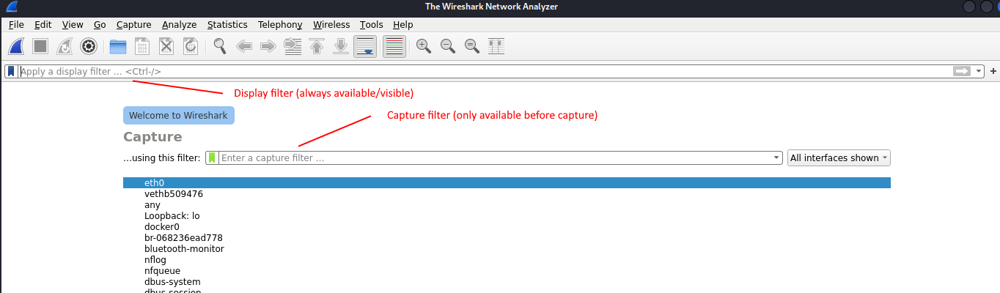

# Wireshark

Wireshark is network sniffing tool.
https://www.wireshark.org/

## Filter

### Display filter

Display filter are applied on already captured packages.

https://wiki.wireshark.org/DisplayFilters
https://www.wireshark.org/docs/wsug_html_chunked/ChWorkBuildDisplayFilterSection.html

**Some concepts**

- Filter by protocol: just type name of protocol. Example: "tcp"
- Filter by protocol field: just type "{protocol}.{field}". Example: "http.request". Any field appearing in the tree can be filtered this way

**Operators**
Operators are C# like but also have a character equivalent.

- "==": equals (also: "eq")
- "!=": not equaly ("ne")
- ">": greater than ("gt")
- "<=" less or equal ("le")
- "contains" -> contains a value
- "matches" -> regualr expression. E.g: "http.host matches "acme\\.(org|com|net)"

**Combine filter expressions**
Also very similar to C# operators but also supports a character equivalent.

- "&&" -> logical and (also "and")
- "||" -> logical or (also "or")
- "!" -> logical not (also "not")
- "^^" -> xor (also "xor")
- "in" -> is in operator
- "[...]" -> slice operator. Take a slice/excerpt of a field
  - Example: `http.content_type[0:4] == "text"`
- "({expression})" -> brackets work the same way as in arithmetic (or C# etc.)

**Examples**

- `ip` -> only ip packages (no lower level protocols like ARP, attention probably will also filter out IPv6)
- `tcp` -> only tcp (filter by protocol name)
- `http.request` -> only filter http requests (filter by field -> http protocol that have a field request)
- `tcp.port == 80` -> only capture tcp traffic on port 80 (src or dest port!)
- `ip.addr == 10.43.54.65` -> only packages with given ip address (src or dest)
- `ip.src == 10.43.54.65 or ip.dst == 10.43.54.65` -> same as "ip.addr == 10.43.54.65"
- `!( ip.addr == 10.43.54.65 )` -> all traffic except coming or going to given IP (Attention, this is not the same as "ip.addr != 10.43.54.65" as that would only filter out messages where src and dest have that IP.)
- `ip.addr == 129.111.0.0/16` -> filter ip addresses with network mask
- `tcp.port eq 25 or icmp` -> show SMTP (port 25) and ICMP traffic
- `http.request.method in{"HEAD", "GET"}` -> get http request with passed methods
- `tcp.port in {80, 443, 8080}` -> tcp ports 80, 443 and 8080
- `http.location[0:12]=="http://pages"` -> http with location. indicates a redirection happens
- `http.content_type[0:4] == "text"` -> filter for content type in http
- `tcp.flags.syn == 0x02`-> display packets with a TCP syn flag

**Advanced**
Just the most important aspects of Wireshark are touched here. Whireshark offers mor advanced features (especially when it comes to filtering).
Functions:

- It is possible to apply functions. Examples: "upper", "lower", "count", "min", etc. (https://www.wireshark.org/docs/wsug_html_chunked/ChWorkBuildDisplayFilterSection.html#DispFunctions )

Others aspects (just names, please have a look at the documentation):

- Layer operator
- Calculations: https://www.wireshark.org/docs/wsug_html_chunked/ChWorkBuildDisplayFilterSection.html#ArithmeticOps
- etc. etc.

### Follow a stream

Often we are only interested in a particular exchange of packages. For example, we just want to follow a specific TCP connection.
To achieve this, right click on a package details, to make the context menu appear. There, choose follow and the protocol you want to follow (TCP, TLS etc.). This will set the display filter to the particular stream. Example: `tcp.stream eq 5`

(CTRL+ALT+SHIFT+T)

### Decrypt TLS

**SSLKEYLOGFILE Using chrome Variant 1**

1. Open xfce4 terminal as non-root, vuia Usual Applications > System (maybe normal bash also works)
2. `export SSLKEYLOGFILE=/tmp/ssl.log` -> set and export the SSLKEYLOGFILE variable (attention, this is from overall base folder "/")
3. Start chrome `/usr/bin/google-chrome-stable` (from same terminal)
   - now there should be an ssl.log in configured folder
4. Start wireshark and set the ssl.log file and then capture
   - Preferences > Protocol > TLS > "(pre)-Master-Secret log filename > "/tmp/ssl.log" (in some exercises file is called "h1.key")
5. Browse https sites in chrome (e.g. "https://www.hacking-lab.com/events/")
6. Check in Wireshark: Wireshark should now decrypt TLS

Remark 1: also possible with FF developer edition
Remark 2: see assignment Internet protocol 1/2 Task 1 (TLS - SSLKEYLOGFILE )

**SSLKEYLOGFILE Using chrome Variant 2 (TCP dump and start Wireshark with Key)**

1. In root shell: `tcpdump -i eth0 host www.ischi.net -w /home/hacker/h2test/h1.pcap`
   - will write pcap fikle "h1.pcap" which can later be opened in Wireshark
2. In user shell: `SSLKEYLOGFILE=/home/hacker/h2test/h1.keys google-chrome --disable-http2 https://www.ischi.net/ost/h2.php`
   - will start chrome and browse past website + write key file "h1.keys"
3. Start Wireshark with pcap and key file: `wireshark -o ssl.keylog_file:/home/hacker/h2test/h1.keys /home/hacker/h2test/h1.pcap`
   - Alternativly, we could start wireshark, open the pcap file manually and set master key file in Preferences > Protocol > TLS > "(pre)-Master-Secret log filename >

**Using private key file (\*.pem)**
Preconditions:
a) One must be in the possession of the private key (\*.pem) that was used to establish the connection
b) PFS (Perfect Forward Secrecy) may not have been active as key used to to establish connection cannot be reconstructed (even with the private key)
Steps:

1. In Wireshark: load intercepted traffic file \*.pcap
2. Configure private key
   - Preferences > Protocol > TLS > RSA key list -> register \*.pem file for IP and Port

Remark: probably by now, most TLS connection rely on PFS and this no longer works

### Capture filters (less important)

Capture filters define what is captured. Their aim is to reduce the size of the captured packages. They are much more limited than display filters. Display filters are usually to be prefered.

They have to be applied before the capture starts. (see image)

https://wiki.wireshark.org/CaptureFilters

**Examples**

- `host 172.18.5.4` -> only capture ip traffic to or from
- `net 192.168.0.0/24` -> only capture ip traffic in the follong ip range (same as "net 192.168.0.0 mask 255.255.255.0")
- `src net 192.168.0.0/24` -> capture traffic from IP range
- `dst net 192.168.0.0/24` -> capture traffic to IP range
- `port 53` -> capture only port 53 (DNS)
- `ip` -> capture only IPv4 traffic (no lower level protocols like ARP)
- `ip6` -> capture only IPv6 traffic (no lower level protocols like ARP)
- `not broadcast and not multicast` -> capture only unicast traffic (get rid of noise)
- `src portrange 2000-2500` -> capture packages with ports in the 2000-2500 range (UDP + TCP)
  -> in Wireshark click on "Capture" > "Capture Filters" to see some more examples

## Varia

https://www.varonis.com/de/blog/verwendung-von-wireshark
https://man.archlinux.org/man/community/wireshark-cli/wireshark-filter.4.en

**Beyond Wireshark**
Other tools:

- Follow TCP stream
   - Tshark (bash of wireshark)
      - https://www.thegeekdiary.com/tshark-command-examples-in-linux/
   - Tcpflow
   - Pcapcat
   - Tcpxtract
- Findsmtpinfo.py (pyhton script -> see assignment powerpoint)
- NetworkMiner (multi purpose tool)
- specialized tools
   - Oftcat
   - smtpdump
