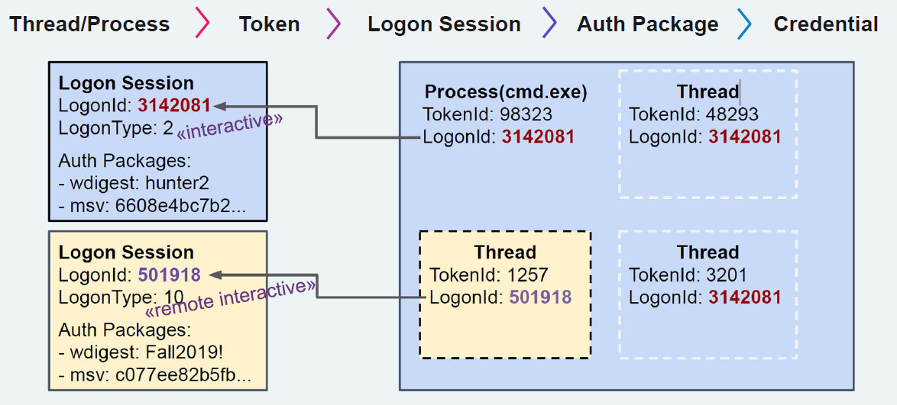

# Windows

## Windows credential management

**Basics**
- Thread/Process > Token > Login Session > Auth Package > Credential
    - tokens (of thread) are tied to login sessions
    - User credentials are tied to Auth packages (NTLM hashes, Kerberos ticktes, pw in plaintext)
- Login sessions contain the authentication packages

Logon Session types
- Network Logons: Type 3
    - Clients prove they have the credentials but do NOT send them
- Non-Network Logins (nteractive/NetworkCleartext/)
    - Type 10 (remote interactive)
    - Type 2 (interactive)

Processes important for logon sessions:
- LSASS  for AD
- SAM for local accounts

*Tools like Mimikatz can exploit the fact that these processes (LSASS, SAM) contain info (like NTML hashes) for attacks*

## DPAPI Data Protection API
API to allow applications to encrypt/decrpyt data (CryptProtectData / CryptUnprotectData). For example username/pw.
Provides applications an easy way to fairly securely store secrets on disk without having to worry about key management overhead/etc. 
DPAPI uses Master keys (for user + machine)

Secrets protected by DPAPI:
- Windows "Credentials*
- IE/chrome logins/cookies
- RDP files w/passwords
- Wifi passwords
- etc. (see pdf)

However, since the process itself needs to be able to decrypt, the stored credentials, can still be accessed (works for local and AD users).
User secret decryption: DPAPI User masterkeys are in LSASS memory for logged on users (more see pdf)

## UAC
- Integrity levels
    - Low
    - Medium
    - High  (admin) -> possible to switch to System
    - System (system) -> possible to switch to High
- Possible to see under which integrity level a process runs in Task manager: Elevated (probably to be added). Also good tools: "Process explorer" and/or "Process monitor" (shows exact integrity level). 
    - `whoami /priv` -> shows current privileges. 
- See privileges of other process
    - Powershell: `Get-TokenPrivs -ProcID 4848`
- Most important privilege is often "SeDebugPrivilege" as it allows to debug (and read memory)
- Bypass UAC (no popup for the user to click)
    - repo with ways to bypass UAC: https://github.com/hfiref0x/UACME
    - usually a combination of Auto-Elevation, Dll hijacking/sideloading
        - as some programs auto-elevate by default (as signed by microsoft) but possible do smuggle in my own dll. 
            - find auto-elevate programs: `Strings.exe -s *.exe | findstr /I "<autoElevate>true</autoElevate>“`
    - to bypass UAC one needs a user with admin rights already (of course as otherwise there would be nothing to bypass)
    - Tools like Cobalt Strike also support bypassing UAC

## Protection against attacks 

**Configuration**
- Deploy an Active Directory administrative tier model
    - https://docs.microsoft.com/en-gb/windows-server/identity/securing-privileged-access/securing-privileged-accessreference-
material
- Make use of Logon Restrictions and Protected Users Group for privileged accounts
    - ensure privileged accounts are never logged on on exposed systems
    - https://docs.microsoft.com/en-us/windows-server/security/credentials-protection-and-management/protected-userssecurity-
group

**From Microsoft**
- Update KB2871997: improved some stuff (like stopping plaintext pw in most/all? cases, limit logon credential cache to logon lifetime )
- LSA Protection (RunAsPPL)
    - prevents apps to access protected processes (like LSASS process)
    - is not bulletproof (but attack will be easier to detect) There are ways around it:
        - Bypass techniques: https://itm4n.github.io/lsass-runasppl/
    - how to deploy: https://docs.microsoft.com/en-us/windows-server/security/credentials-protection-and-management/configuring-additionallsa-
protection
- Credential guard (Win10/WinServer 2016)
    - isolates secrets in virtualized secure enfironments
    - solves problems but not so easy to introduce in company networks (probably due to backwards compatibility)
    - how to deploy: https://docs.microsoft.com/en-us/archive/blogs/ash/windows-10-device-guard-and-credential-guard-demystified
- other recommendation from Microsoft
    - https://download.microsoft.com/download/7/7/A/77ABC5BD-8320-41AF-863C-6ECFB10CB4B9/Mitigating-Pass-the-
Hash-Attacks-and-Other-Credential-Theft-Version-2.pdf
    - https://download.microsoft.com/download/7/7/a/77abc5bd-8320-41af-863c-6ecfb10cb4b9/mitigating%20pass-thehash%
20(pth)%20attacks%20and%20other%20credential%20theft%20techniques_english.pdf