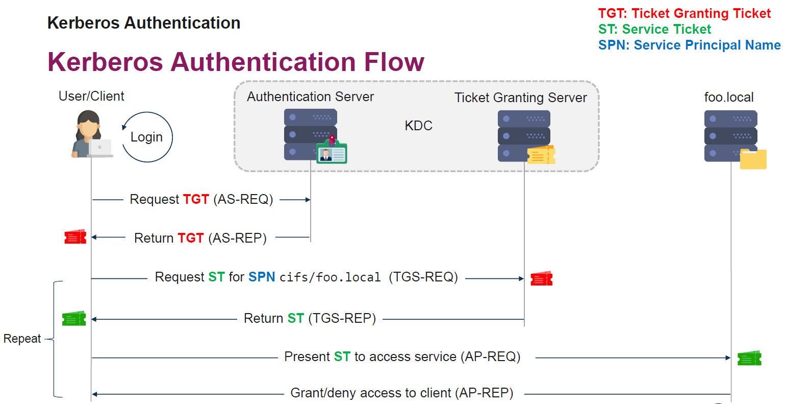

# Windows

## Windows credential management

**Login Session/tokens etc**
- Thread/Process > Token > Login Session > Auth Package > Credential
    - tokens (of thread) are tied to login sessions
    - User credentials are tied to Auth packages (NTLM hashes, Kerberos ticktes, pw in plaintext)
- Login sessions contain the authentication packages

Logon Session types
- Network Logons: Type 3
    - Clients prove they have the credentials but do NOT send them
- Non-Network Logins (nteractive/NetworkCleartext/)
    - Type 10 (remote interactive, e.g. RDP)
        - means if i log in via RDP to another machine, that machine will have my credentials in LSASS as well! (meaning, if a have a local admin on that machine, I can read the NTLM hash from LSASS if NTLM was used)
    - Type 2 (interactive)
see WindowsSecurityLogQuickref.pdf

| Logon Type  | Description   |
| --------------- | ---------------------------------- |
|2| Interactive (logon at keyboard and screen of system) |
|3| Network (connection to shared folder on this computer from elsewhere on network) |
|4| Batch (scheduled task) |
|5| Service (Service startup) |
|7| Unlock (unnattended workstation with password protected screen saver) |
|8 | NetworkCleartext: Logon with credentials sent in the clear text. Most often indicates a logon to IIS with basic authentication. |
|9 | NewCredentials such as with RunAs or mapping a network drive with alternate credentials. "A caller cloned its current token and specified new credentials for outbound connections. The new logon session has the same local identity but uses different credentials for other network connections." |
|10| RemoteInteractive (Terminal Services, Remote Desktop or Remote Assistance) |
|11|CachedInteractive (logon with cached domain credentials such as when logging on to a laptop when away from the network) |

Processes important for logon sessions:
- LSASS  for AD
- SAM for local accounts

*Tools like Mimikatz can exploit the fact that these processes (LSASS, SAM) contain info (like NTML hashes) for attacks*

**Varia**
- Hidden Network shares
    - Windows systems have hidden network shares that are accessible only to administrators. Examples include C$, ADMIN$, and IPC$. Adversaries may use administrator-level accounts to transfer binaries to the target host using SMB, and run them using the Service Control Manager
    - also used by PsExec

## DPAPI Data Protection API
API to allow applications to encrypt/decrpyt data (CryptProtectData / CryptUnprotectData). For example username/pw.
Provides applications an easy way to fairly securely store secrets on disk without having to worry about key management overhead/etc. 
DPAPI uses Master keys (for user + machine)

Secrets protected by DPAPI:
- Windows "Credentials*
- IE/chrome logins/cookies
- RDP files w/passwords
- Wifi passwords
- etc. (see pdf)

However, since the process itself needs to be able to decrypt, the stored credentials, can still be accessed (works for local and AD users).
User secret decryption: DPAPI User masterkeys are in LSASS memory for logged on users (more see pdf)

## UAC
- Integrity levels
    - Low
    - Medium
    - High  (admin) -> possible to switch to System
    - System (system) -> possible to switch to High
- Possible to see under which integrity level a process runs in Task manager: Elevated (probably to be added). Also good tools: "Process explorer" and/or "Process monitor" (shows exact integrity level). 
    - `whoami /priv` -> shows current privileges. 
- See privileges of other process
    - Powershell: `Get-TokenPrivs -ProcID 4848`
- Most important privilege is often "SeDebugPrivilege" as it allows to debug (and read memory)
- Bypass UAC (no popup for the user to click)
    - repo with ways to bypass UAC: https://github.com/hfiref0x/UACME
    - usually a combination of Auto-Elevation, Dll hijacking/sideloading
        - as some programs auto-elevate by default (as signed by microsoft) but possible do smuggle in my own dll. 
            - find auto-elevate programs: `Strings.exe -s *.exe | findstr /I "<autoElevate>true</autoElevate>“`
    - to bypass UAC one needs a user with admin rights already (of course as otherwise there would be nothing to bypass)
    - Tools like Cobalt Strike also support bypassing UAC

## Protection against attacks 

**Configuration**
- Deploy an Active Directory administrative tier model (against Pass-the-hash)
    - Tier 0 -> highest privige (Domain controller)
    - Tier 1 -> servers (sensitive business data)
    - Tier 2 -> normal workstation
    - One Tier can usually not interact with another tier. However, every tier has an admin workstation, from which it is possible to "break" tiers in a way that pass-the-way is not possible. (e.g. from admin workstation in tier 3, user has to log on to server in tier 1 via RDP. from which pass-the-hash is not possible)
        - Sometimes instead to log on from admin workstation to the next tier, a jump host is used (a machine to connect between tiers)
    - More: https://docs.microsoft.com/en-gb/windows-server/identity/securing-privileged-access/securing-privileged-accessreference-
material
- Make use of Logon Restrictions and Protected Users Group for privileged accounts (i believe it requires update KB28791997)
    - ensure privileged accounts are never logged on on exposed systems (mainly against pass-the-hash)
    - https://docs.microsoft.com/en-us/windows-server/security/credentials-protection-and-management/protected-userssecurity-
group
- Against NTLM relay
    - Active "SMB Signing"
    - Disable LLMNR & NBT-NS  (so attacker cannot get become into man-in-the-middle position easily)

**From Microsoft**
- Update KB2871997: improved some stuff
    - disables cleartext pw in memory by default
    - Protected Users group -> NTML hash or users in that group will not be cached! (SSO is not possible, user has to enter pw)
    - For local accounts only: Groups "Local account"
- LSA Protection (RunAsPPL)
    - prevents apps to access protected processes (like LSASS process)
    - is not bulletproof (but attack will be easier to detect) There are ways around it:
        - Bypass techniques: https://itm4n.github.io/lsass-runasppl/
    - how to deploy: https://docs.microsoft.com/en-us/windows-server/security/credentials-protection-and-management/configuring-additionallsa-
protection
- Credential guard (Win10/WinServer 2016)
    - isolates secrets in virtualized secure enfironments
    - solves problems but not so easy to introduce in company networks (probably due to backwards compatibility)
    - how to deploy: https://docs.microsoft.com/en-us/archive/blogs/ash/windows-10-device-guard-and-credential-guard-demystified
- other recommendation from Microsoft
    - https://download.microsoft.com/download/7/7/A/77ABC5BD-8320-41AF-863C-6ECFB10CB4B9/Mitigating-Pass-the-
Hash-Attacks-and-Other-Credential-Theft-Version-2.pdf
    - https://download.microsoft.com/download/7/7/a/77abc5bd-8320-41af-863c-6ecfb10cb4b9/mitigating%20pass-thehash%
20(pth)%20attacks%20and%20other%20credential%20theft%20techniques_english.pdf

## NTLM
NTLM is available in "modern" windows alongside Keberos. Used when Kerberos is not working or supported (standalone server is not domain joined, kerberos is not supported, ip address is used, DNS fails). 
Disabling NTLM would break features, therefore disable is not usually not an option (not sure if it is even possible)

Authentication works with challenge response. In a Active Directory environment, the Domain controller will ultimatly validate the (challenged) response. For local accounts the local machine (or for home networks probably a server) will check the (challenged) response.
1. Client requests access
2. Server sends challenge message
3. Clients sends response (challenge is encrypted with NTLM hash of user, which is in LSASS memory)
    4. Server sends challenge and response to domain controller
    5. Domain controller challenge and response to authenticate user
6. Server sends response to client. 

Where are NTML hashes stored (can be accessed with local admin privileges):
- SAM: saves NTML hashes of local users
- LSASS process: caches NTML hashes of domain users
    - My understanding: I'm on machine A and log on to machine B via NTLM, the LSASS process of A now contains my NTLM hash
- Domain controller(s): stores NTML hashes of all domain users (NTDS.dit)

**Varia**
- NTLM hash -> multiple names (when googling) -> actually is a MD4 hash
- NTLM hash lacks salting.. basically just the hash: MD4(UTF-16-LE(password))

### Attacks on NTLM

**Crack the hash (get pw)**
Premise: we have managed to get access to an NTLM hash (via LSASS). Since MD4 is outdated, password can be cracked.

**Pass-The-Hash**
Since the answer to the challenge (see NTLM workflow) just requires the NTLM hash and not the actual password, an attacker that got hold of an NTLM hash can authenticate against any service that supports NTLM (e.g.: SMB, LDAP, WMI, RDP)
*Remark: not working againg a regular windows tool or ui as there, the password is required*

Tools for pass the hash: Mimikatz (local only), Cobalt Strike, Metasploit, Impacket, CrackMapExec (see pdf)

**NTLM Relaying**
Attacker, who is already man-in-the-middle uses NTLM relaying to authenticate himself against a different machine. 
Man-in-the-middle just forwards NTLM challenge response (NetNTLM) to the server he wants to authenticate.

On windows, one way to get into the man-ind-the middle position is the usage of the old protocols LLMNR/NBT-NS, which are used when DNS fails. (i believe they are disabled on a domain controller but still  active otherwise). So attacker can try to trigger a a request to non-existing domain, so DNS fails and it will fallback to LLMNR/NBT-NS. (For example with an image source in a mail: "file:///\\nonexisting-UNC\somePath\resource")
NTLM relaying is often used with SMB but also possible with HTTP, LDAP etc.
Countermeasure: "SMB Signing must be activated" (only default on domain controllers)
*Tools for NTLM relay: Inveigh (windows/powershell), Responder (Linux/Python)*

## Kerberos
Protocol for authentication, default authentication in windows. 

Building blocks
    - Authentication Server (AS)
        - basically returns a "Ticket Granting Ticket" (TGT) against credentials
    - Ticket Granting Server (TGS)
        - will provide a service ticket (ST) against a TGT for a particular service
            - ST is specific to a a service.
    - Services with "Service Principal Name" (SPN)
        - unique identifier of a service instance within the domain
        - Format: <service class>/<host>:<port>/<service name>
            - example: MSSQLSvc/ws1.winattacklab.local:1433
 
 

Some aspects: 
- ticket based
- mutual authentication (no man in the middle)
    - Example: sql server would authenticate via "MSSQLSvc/ws1.winattacklab.local:1433"
- based on shared secrets and  temporary session keys
    - example: (part) TGT is encrypted via with key of TG, so client cannot read it but pass it to TGS which can interpret it and knows that the TGT was actually handed out by the Authentication server (details see pdf)
- "krbtgt" Account
    - built-in account or the KDC service
    - is disabled (and cant be activated)
    - its hash is used to encrypt TGT's 
        - therefore like a masterkey 
        - password is not changed automatically (so many AD's in practice still have the same)
- account policy info is in the TGT (stateless)
    - can be abused when we are able to build golden/silver tickets (build working tickets with disabled)

### Kerberos attacks

**Overpass the hash** (aka pass-the-key) -> attack
Passing a stolen encryption key (Pre-Authentication data) to get a TGT for another user
Using the pre-authentication data ()
-> similar pass-the-hash for NTLM, just for kerberos

good explanation: https://www.whitehat.de/active-directory-hacking-angriffe-mit-mimikatz/pass-the-key-ptk-overpass-the-hash-oth

**Pass the ticket** -> attack
Steal tickets
    - steal "Ticket Granting Ticket" TGT 
    - steal service ticket (ST)
How to get the tickets: with local admin rights possible to dump them from LSASS
(can be done via tools like Mimikatz, Cobalt Strike, Rubeus)

**Golden tickets (and silver ticket)**  -> attack
    - forged ticket-granting tickets (TGTs)
    - When we just forge a service ticket (ST) it is called silver ticket
    - Since all account policies are passed in tickets, we can forge autorisation data
        - group memberships, account disabled etc.)
        - it used to be even possible with non-existing users (no longer possible though)
*Remark: AD security boundary is the forest, not the domain. So if we get a golden ticket for a domain.. we can compromise the entire forest (see powerpoint)

**Kerberoasting** -> attack (cracking ticket)
Background: every user can request a ticket for any service, even if user has no right to it. With such a ticket, the password for the service ticket can be cracked.
-> possible because service accounts might have weak passwords and use a weak algorithm by default (RC4). Machine accounts passwords are strong and use a strong ciphery (AES), so this is (normally) not possible.
1. Find a user/service account with a service principal name (SPN)
2. Request a service ticket with RC4_HMAC_MD5 encryption and extract a hash from it
    - if SPN is registered for a user/service account and not a machine account, the users pw might be weak
3. try crack password  (possible tools: hashcat, John the Ripper)
To avoid detection (OpSec considerations): dont just request service tickets for every user, ......
-> also see pdf